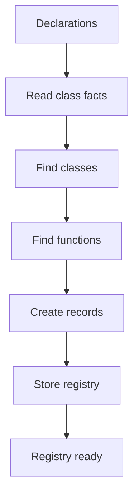
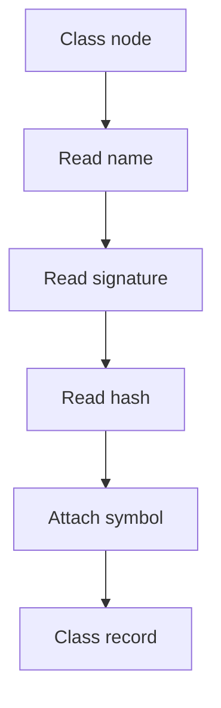
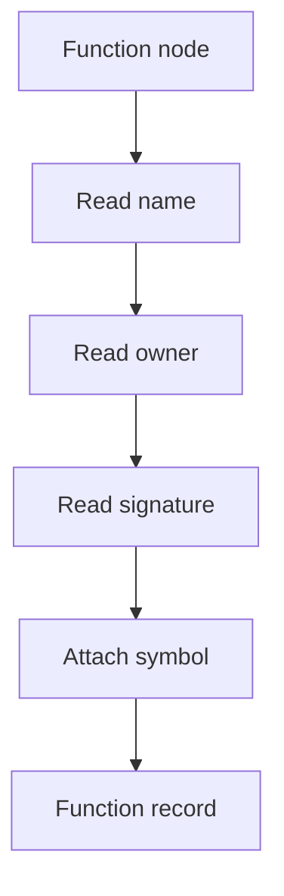
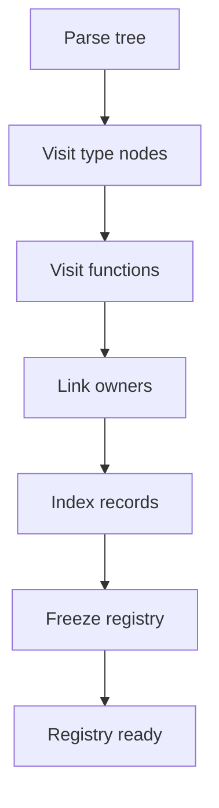
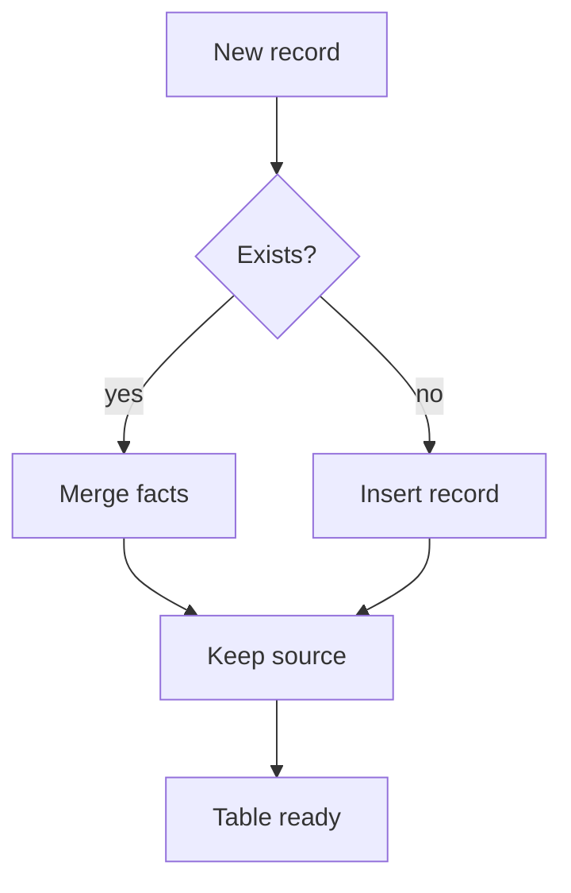

# pattern_registry.cpp

## Role
Creates one shared registry from completed class declarations for Behavioural and Creational hooks. This prevents each pattern from walking the parse tree and registering the same classes again.

## Intended Source Role
This file maps to the future registry builder. It should be called once by the middleman after class declaration generation and before any pattern hook runs.

## Registry Flow

## Class Record

## Function Record

## Registry Tables
- Class table by name.
- Class table by node id.
- Function table by name.
- Method table by owner.
- Constructor table by class.
- Reference table by symbol.

## Build Steps

## Duplicate Policy

