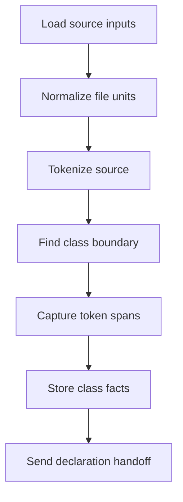
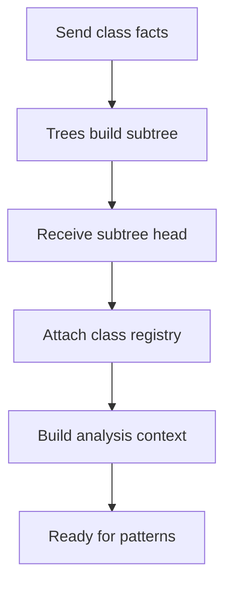
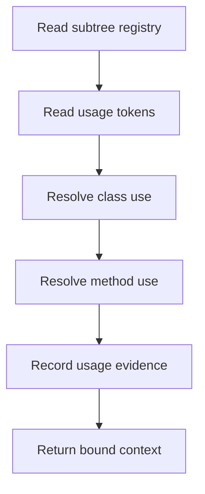
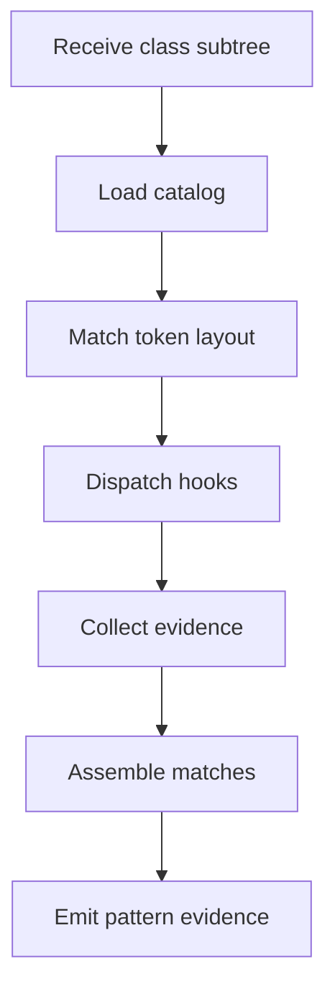
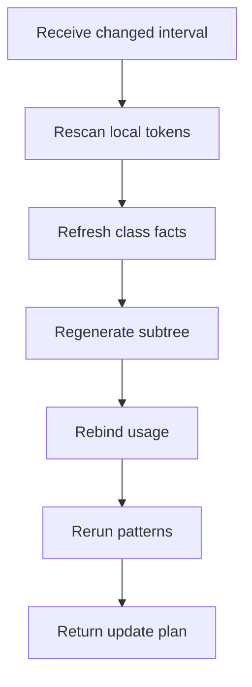

# `core.cpp`

- Folder: `docs/Codebase/Microservice/Modules/Source/Analysis`
- Role: analysis-stage coordination for intake, lexical class facts, usage binding, and subtree-first pattern recognition

## Start Here
- Read this file first for the stage workflow.
- Then read `Input/`, `Lexical/`, `ImplementationUse/`, and `Patterns/` in that order.

## Quick Summary
- This stage emits the structural and usage context that tree generation, catalog recognition, and hash identity consume.
- It finds class candidates, captures ordered class token spans, hands class facts to `Trees/`, receives completed actual class-declaration subtree heads, binds usage back to declarations, and only then runs catalog-driven pattern recognition.
- The actual class-declaration subtree is the required input to structural pattern analysis. Pattern checks do not run from raw lexical events alone.

## Why This Stage Is Separate
- `Analysis/` decides structural meaning and usage binding.
- `Trees/` builds declaration-side tree views.
- `Patterns/Catalog/` loads supported pattern definitions after declaration generation has enough class facts.
- `HashingMechanism/` creates propagated identities and lookup chains.
- `Diffing/` can ask this stage to refresh lexical structure for changed source intervals.
- `OutputGeneration/` emits downstream artifacts.

## Major Workflow
The analysis flow is split into small Mermaid slices so the class-subtree handoff is visible without turning one diagram into an oversized pipeline.

### Intake And Class Facts
Quick summary: lexical analysis produces class facts and ordered token spans, but it does not accept design patterns.
Why this is separate: this stage is the local analysis work before `Trees/` materializes a class-declaration subtree.

### Declaration Subtree Handoff
Quick summary: analysis pauses final pattern recognition until the actual class-declaration subtree exists.
Why this is separate: `Trees/` owns subtree materialization; this analysis file owns the before-and-after contract.

### Usage Binding
Quick summary: usage binding connects implementation use back to the completed class declarations and registered subtree heads.
Why this is separate: usage evidence is shared by hashing, reports, and pattern hooks, so it should be complete before catalog dispatch.

### Pattern Recognition
Quick summary: catalog and hook checks run against completed class subtrees, not raw scan state.
Why this is separate: this is the point where structural pattern analysis is allowed to start.

### Interval Refresh
Quick summary: diffing reuses the same order when only part of a source file changed.
Why this is separate: partial regeneration must preserve the class-subtree-first contract instead of running pattern checks directly on changed text.

## Handoff
- Hands to `../Trees/core.cpp.md` once lexical class facts are ready to become an actual class-declaration subtree.
- Receives completed class-subtree heads back into `Patterns/Catalog/` and `Patterns/Middleman/` for automatic recognition.
- Hands to `../HashingMechanism/core.cpp.md` once usage and structure need stable propagated identities.
- Serves `../Diffing/core.cpp.md` during interval checks by re-emitting lexical structural signals for changed regions.

## Local Ownership
- `Input/` owns source intake and argument-facing entry.
- `Lexical/` owns token scanning and structural event extraction.
- `ImplementationUse/` owns scope-aware usage binding such as `p1 -> Person`.
- `Patterns/` owns all-pattern recognition after actual class-declaration subtrees and analysis context exist.

## Acceptance Checks
- Structural scanning stays separate from tree generation.
- Actual usage binding is visible before hash-based lookup.
- Ordered class token streams are available before catalog recognition.
- Pattern checks run after actual class-declaration subtree generation instead of during class scanning.
- Mermaid diagrams show the class-subtree handoff before structural pattern analysis.
- New supported structures can be added through the pattern catalog before adding custom hook code.
