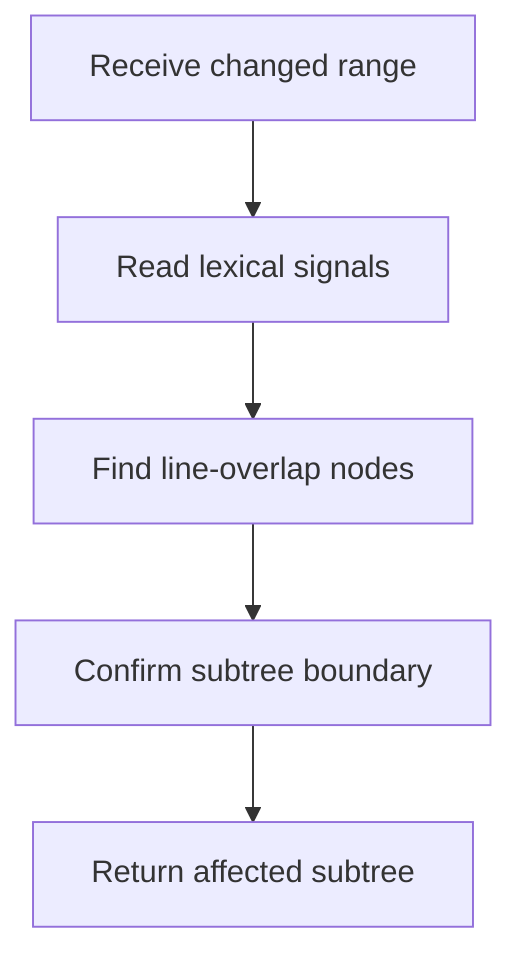

# core.cpp

- Folder: `docs/Codebase/Microservice/Modules/Source/Diffing/AffectedNodeLocator`
- Role: changed-range to affected-node locator

## Main Intent
This file receives changed source intervals and refreshed lexical structure events. It uses `start_line` and `end_line` metadata only to find candidate actual-tree nodes, then confirms the subtree boundary using lexical structure.

## Program Flow

## Acceptance Checks
- It never treats line comparison as semantic diffing.
- It returns the smallest safe subtree boundary for regeneration.
- It preserves enough identity for later virtual-to-actual mapping.

