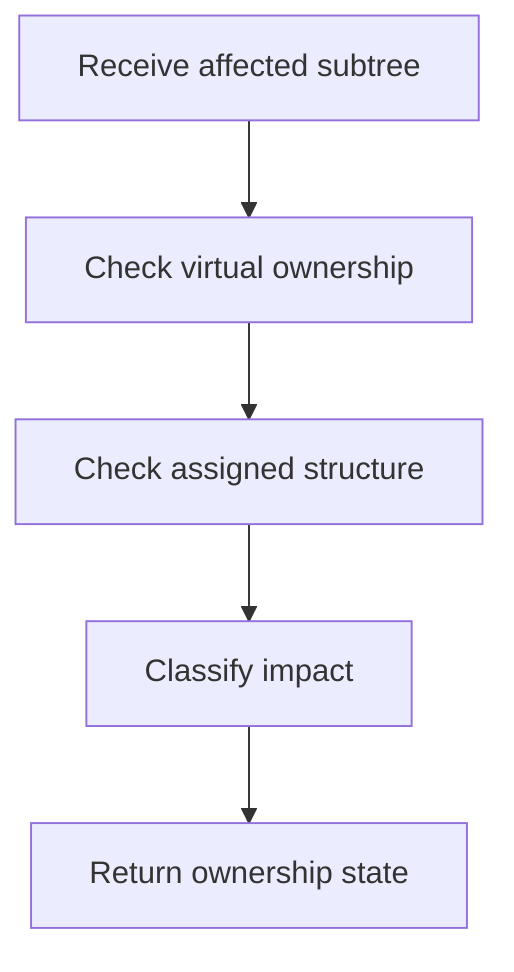

# core.cpp

- Folder: `docs/Codebase/Microservice/Modules/Source/Diffing/PatternOwnership`
- Role: pattern ownership classifier

## Main Intent
This file decides whether the affected subtree is inside an existing virtual-broken subtree, outside pattern ownership, newly pattern-compatible, or no longer pattern-compatible.

## Program Flow

## Classification Values
- `PatternOwnedChanged`
- `OutsidePatternChanged`
- `BecamePatternCandidate`
- `PatternStructureRemoved`
- `Unknown`

## Acceptance Checks
- Existing virtual ownership is detected before new-pattern eligibility.
- Newly pattern-compatible actual subtrees can trigger virtual branch creation.
- Removed pattern structure can trigger virtual branch discard.

