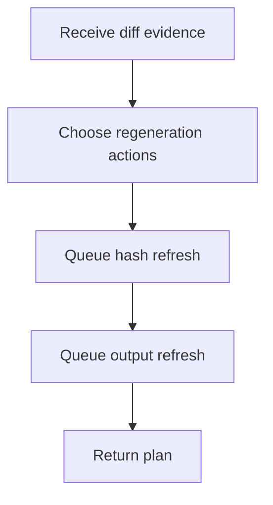

# core.cpp

- Folder: `docs/Codebase/Microservice/Modules/Source/Diffing/RegenerationPlan`
- Role: partial regeneration planner

## Main Intent
This file converts affected subtree location, ownership classification, and subtree comparison results into a scoped regeneration plan.

## Program Flow

## Plan Actions
- regenerate actual subtree
- regenerate virtual subtree
- attach virtual subtree
- discard virtual subtree
- refresh scoped hashes
- notify output generation

## Acceptance Checks
- The plan scopes regeneration to affected subtree boundaries.
- Hashing is refreshed only for affected nodes and dependent ancestors.
- Output generation receives a report instead of re-inferring diff state.
