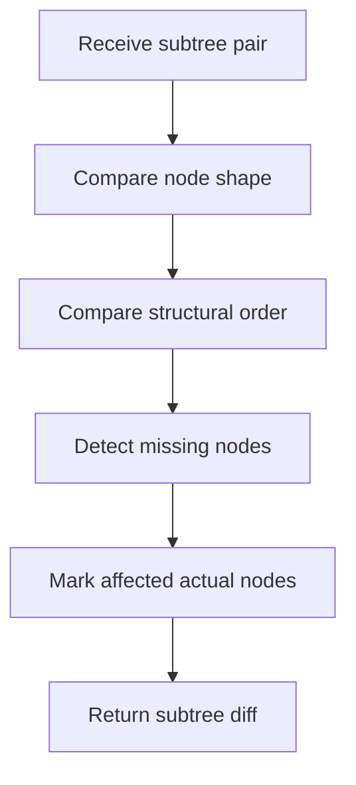

# core.cpp

- Folder: `docs/Codebase/Microservice/Modules/Source/Diffing/SubtreeComparison`
- Role: subtree equivalence comparison

## Main Intent
This file compares a regenerated virtual-broken subtree with its equivalent actual parse subtree. The output identifies which equivalent actual nodes need regeneration.

## Program Flow

## Acceptance Checks
- It checks structure and order, not business logic.
- It compares equivalent subtree boundaries only.
- It produces node-level regeneration targets.

