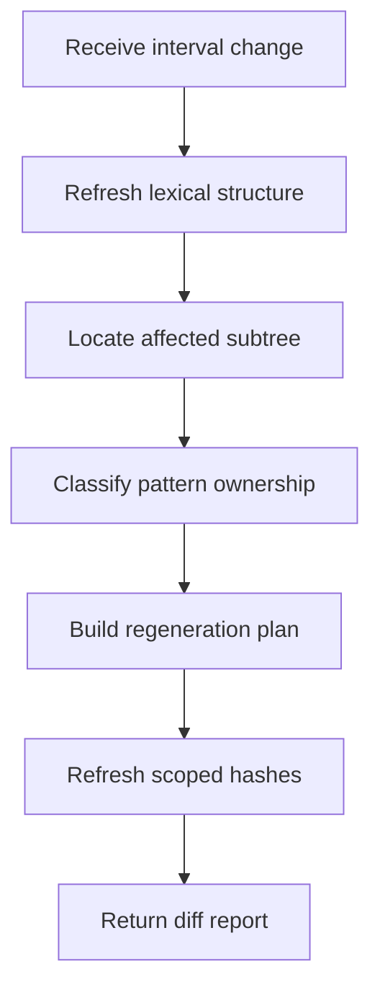
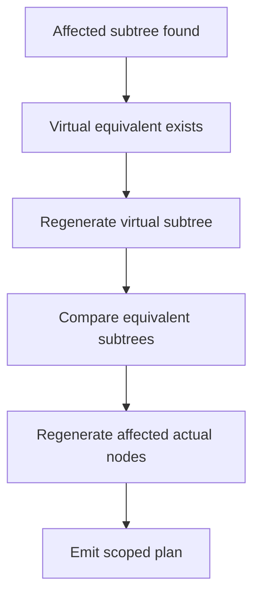
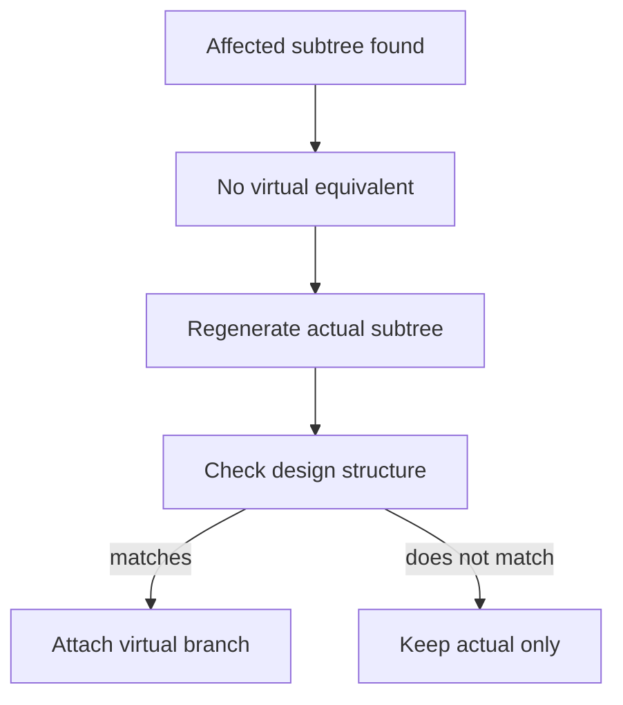

# core.cpp

- Folder: `docs/Codebase/Microservice/Modules/Source/Diffing`
- Role: diffing subsystem entrypoint

## Main Intent
This file owns the interval auto-check workflow. Every interval re-runs lexical structural analysis for the changed region, uses line metadata only to locate the affected actual-tree node, then plans partial regeneration around the affected subtree.

## Important Rule
Line ranges are locator metadata, not the diffing algorithm. Diffing happens after the affected subtree is known.

## Program Flow
This slice shows the main interval workflow.

## Why The Flow Is Split
Lexical refresh, node location, subtree comparison, ownership classification, and regeneration are separate because each one calls a different subsystem boundary.

## Existing Virtual Ownership
If the changed actual subtree has an equivalent virtual-broken subtree, regenerate the virtual copy first. After the virtual subtree is structurally valid again, compare it with the equivalent actual parse subtree and regenerate only the actual nodes affected by that comparison.

## No Existing Virtual Ownership
If the affected actual subtree is not represented in the virtual-broken tree, regenerate only the actual subtree. Then re-run assigned design-structure verification. If it now follows a design structure, create and attach a new virtual-broken subtree.

## Acceptance Checks
- Every interval check starts with lexical structural analysis for the changed region.
- Line ranges only identify the affected actual node/subtree.
- Existing virtual ownership regenerates virtual first, then compares against actual equivalent.
- Non-virtual areas regenerate actual first, then recheck design-structure eligibility.
- Hash refresh is scoped to affected subtree boundaries and dependent ancestors.

