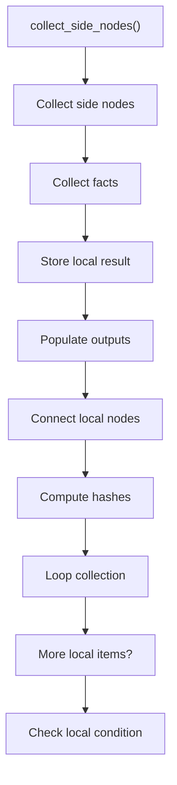
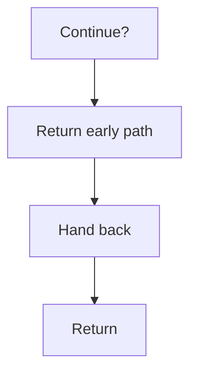

# collect_side_nodes.cpp

- Source document: [hash_links_collect.cpp.md](../../hash_links_collect.cpp.md)
- Purpose: decoupled implementation logic for a future code unit.

### collect_side_nodes()
This routine connects discovered items back into the broader model owned by the file.

Inside the body, it mainly handles collect derived facts for later stages, store local findings, fill local output fields, and connect local structures.

The implementation iterates over a collection or repeated workload. It branches on runtime conditions instead of following one fixed path.

What it does:
- collect derived facts for later stages
- store local findings
- fill local output fields
- connect local structures
- compute hash metadata
- walk the local collection
- branch on local conditions

Flow:

### Block 2 - collect_side_nodes() Details
#### Slice 1 - Establish Local Entry
Quick summary: This slice shows the first file-local stage for collect_side_nodes.cpp and keeps the diagram scoped to this code unit.
Why this is separate: collect_side_nodes.cpp has multiple branches, loops, or stage changes, so this section is split out to keep one major intent visible at a time instead of forcing one oversized diagram.

#### Slice 2 - Handle Early Decisions
Quick summary: This slice shows the first local decision path for collect_side_nodes.cpp after setup.
Why this is separate: collect_side_nodes.cpp has multiple branches, loops, or stage changes, so this section is split out to keep one major intent visible at a time instead of forcing one oversized diagram.

