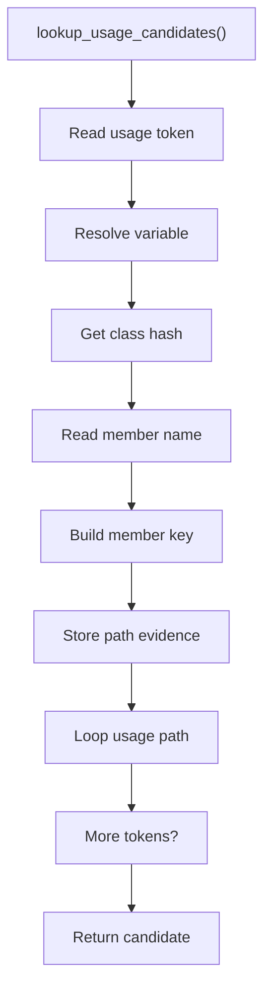
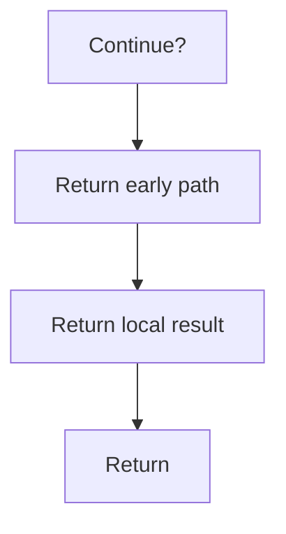

# lookup_usage_candidates.cpp

- Source document: [hash_links_collect.cpp.md](../../hash_links_collect.cpp.md)
- Purpose: decoupled implementation logic for a future code unit.

### lookup_usage_candidates()
This routine owns one focused piece of the file's behavior.

Inside the body, it mainly handles search previously collected data, look up local indexes, store local findings, and fill local output fields.

The implementation iterates over a collection or repeated workload. It branches on runtime conditions instead of following one fixed path. The caller receives a computed result or status from this step.

What it does:
- search previously collected data
- look up local indexes
- store local findings
- fill local output fields
- compute hash metadata
- walk the local collection
- branch on local conditions

Implementation contract:
- Usage candidate lookup should preserve object-variable bindings and member-call evidence.
- For `Person p1`, the usage candidate binds variable `p1` to the resolved `Person` class hash.
- For `p1.speak()`, lookup should use the variable binding to select the `Person` class head, then use the child/member hash to locate the `speak` function head under that class.
- Child hashes identify exact location in the usage path; they do not own the class or function record.

Flow:

### Block 5 - lookup_usage_candidates() Details
#### Slice 1 - Establish Local Entry
Quick summary: This slice resolves usage candidates through class bindings before member lookup.
Why this is separate: member names are ambiguous until the object variable resolves to a class hash.

#### Slice 2 - Handle Early Decisions
Quick summary: This slice shows the first local decision path for lookup_usage_candidates.cpp after setup.
Why this is separate: lookup_usage_candidates.cpp has multiple branches, loops, or stage changes, so this section is split out to keep one major intent visible at a time instead of forcing one oversized diagram.

