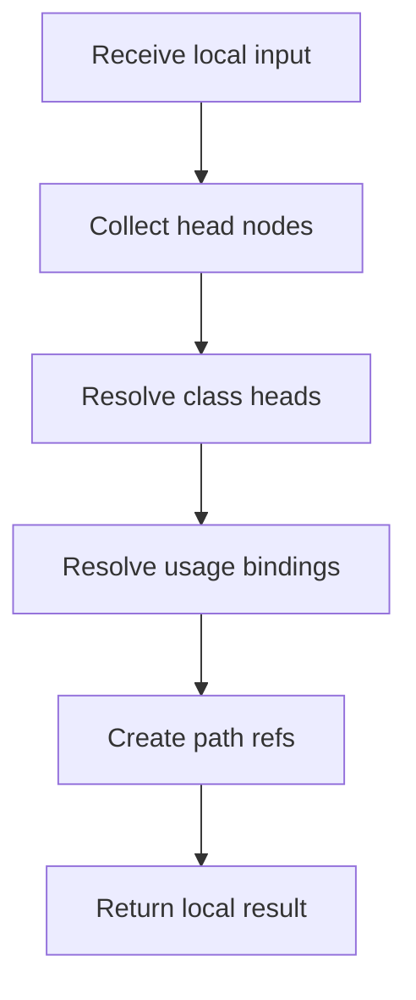

# hash_links_collect.cpp

- Source: Microservice/Modules/Source/ParseTree/hash_links_collect.cpp
- Kind: C++ implementation

## Story
### What Happens Here

This source file implements one internal part of the generic parse-tree engine. It contributes specialized behavior such as dependency handling, symbolization, hash-link construction, rendering, or older generation helpers after the raw tree exists. This source file implements one of the generic middle-stage services in the C++ pipeline. It is executed after sources are loaded and before the final report and rendered outputs are written.

### Why It Matters In The Flow

Runs across the middle of the microservice flow to build parse trees, hash links, symbol tables, documentation tags, reports, and rendered outputs.

### What To Watch While Reading

Implements parsing, shadow-tree building, symbolization, hash linking, rendering, and reporting. The main surface area is easiest to track through symbols such as collect_side_nodes, build_node_refs, lookup_class_candidates, and lookup_usage_candidates. It collaborates directly with Internal/parse_tree_hash_links_internal.hpp, cstddef, functional, and string.

Collection should separate head-node candidates from child-path evidence. Class and function candidates resolve to head records; usage candidates may carry variable bindings and member-call paths.

## Program Flow
Quick summary: this diagram shows the file-local activity path for this implementation unit. It stays inside this code file and uses only entry and return boundaries as external references.

Why this slice is separate: deeper helper docs can explain individual functions, while this file still needs to show the main activity path in place.

Detailed program flow is decoupled into future implementation units:

- [program_flow](./hash_links_collect/hash_links_collect_program_flow.cpp.md)
## Reading Map
Read this file as: Implements parsing, shadow-tree building, symbolization, hash linking, rendering, and reporting.

Where it sits in the run: Runs across the middle of the microservice flow to build parse trees, hash links, symbol tables, documentation tags, reports, and rendered outputs.

Names worth recognizing while reading: collect_side_nodes, build_node_refs, lookup_class_candidates, and lookup_usage_candidates.

It leans on nearby contracts or tools such as Internal/parse_tree_hash_links_internal.hpp, cstddef, functional, string, unordered_map, and utility.

## Story Groups

### Finding What Matters
These steps pick out the facts, traces, and relationships that later stages need.
- collect_side_nodes(): Collect derived facts for later stages, store local findings, and fill local output fields
- lookup_class_candidates(): Search previously collected data, inspect or register class-level information, and look up local indexes
- lookup_usage_candidates(): Search previously collected data, look up local indexes, and store local findings

### Building The Working Picture
These steps assemble the trees, models, or bundles used by the rest of the file.
- build_node_refs(): Create the local output structure, store local findings, and connect local structures

## Function Stories
Function-level logic is decoupled into future implementation units:

- [collect_side_nodes](./hash_links_collect/functions/collect_side_nodes.cpp.md)
- [build_node_refs](./hash_links_collect/functions/build_node_refs.cpp.md)
- [lookup_class_candidates](./hash_links_collect/functions/lookup_class_candidates.cpp.md)
- [lookup_usage_candidates](./hash_links_collect/functions/lookup_usage_candidates.cpp.md)
## Documentation Note
- This markdown file is part of the generated docs/Codebase mirror.
- It was generated from the repository state on 2026-04-23 after reading the existing docs corpus and the current source tree.
