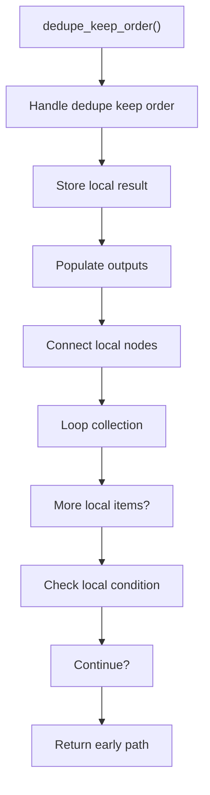
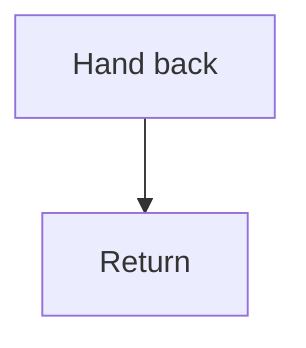

# dedupe_keep_order.cpp

- Source document: [hash_links_common.cpp.md](../../hash_links_common.cpp.md)
- Purpose: decoupled implementation logic for a future code unit.

### dedupe_keep_order()
This routine owns one focused piece of the file's behavior.

Inside the body, it mainly handles store local findings, fill local output fields, connect local structures, and walk the local collection.

The implementation iterates over a collection or repeated workload. It branches on runtime conditions instead of following one fixed path.

What it does:
- store local findings
- fill local output fields
- connect local structures
- walk the local collection
- branch on local conditions

Flow:

### Block 5 - dedupe_keep_order() Details
#### Slice 1 - Establish Local Entry
Quick summary: This slice shows the first file-local stage for dedupe_keep_order.cpp and keeps the diagram scoped to this code unit.
Why this is separate: dedupe_keep_order.cpp has multiple branches, loops, or stage changes, so this section is split out to keep one major intent visible at a time instead of forcing one oversized diagram.

#### Slice 2 - Handle Early Decisions
Quick summary: This slice shows the first local decision path for dedupe_keep_order.cpp after setup.
Why this is separate: dedupe_keep_order.cpp has multiple branches, loops, or stage changes, so this section is split out to keep one major intent visible at a time instead of forcing one oversized diagram.

