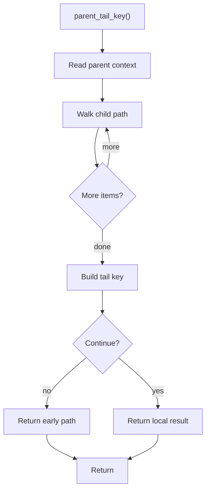

# parent_tail_key.cpp

- Source document: [hash_links_common.cpp.md](../../hash_links_common.cpp.md)
- Purpose: decoupled implementation logic for a future code unit.

### parent_tail_key()
This routine owns one focused piece of the file's behavior.

Inside the body, it mainly handles walk the local collection and branch on local conditions.

The implementation iterates over a collection or repeated workload. It branches on runtime conditions instead of following one fixed path. The caller receives a computed result or status from this step.

What it does:
- walk the local collection
- branch on local conditions

Implementation contract:
- Build the tail portion of a lookup key from the immediate parent context and the child token path.
- Use it to distinguish repeated visible names under different classes or files.
- The tail key should guide lookup to the exact child location after a head node has already been selected.
- Do not use a tail key as a replacement for class or function head-node registry ownership.

Flow:

