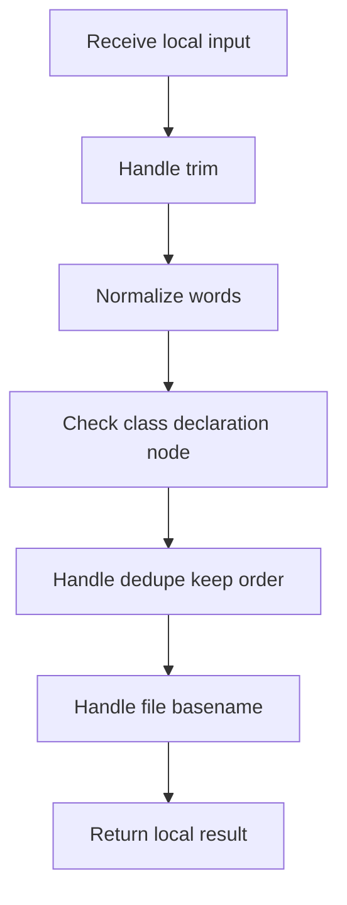

# hash_links_common.cpp

- Source: Microservice/Modules/Source/ParseTree/hash_links_common.cpp
- Kind: C++ implementation

## Story
### What Happens Here

This source file implements one internal part of the generic parse-tree engine. It contributes specialized behavior such as dependency handling, symbolization, hash-link construction, rendering, or older generation helpers after the raw tree exists. This source file implements one of the generic middle-stage services in the C++ pipeline. It is executed after sources are loaded and before the final report and rendered outputs are written.

### Why It Matters In The Flow

Runs across the middle of the microservice flow to build parse trees, hash links, symbol tables, documentation tags, reports, and rendered outputs.

### What To Watch While Reading

Implements parsing, shadow-tree building, symbolization, hash linking, rendering, and reporting. The main surface area is easiest to track through symbols such as trim, file_basename, split_words, and class_name_from_signature. It collaborates directly with Internal/parse_tree_hash_links_internal.hpp, Language-and-Structure/language_tokens.hpp, algorithm, and cctype.

## Program Flow
Quick summary: this diagram shows the file-local activity path for this implementation unit. It stays inside this code file and uses only entry and return boundaries as external references.

Why this slice is separate: deeper helper docs can explain individual functions, while this file still needs to show the main activity path in place.

Detailed program flow is decoupled into future implementation units:

- [program_flow](./hash_links_common/hash_links_common_program_flow.cpp.md)
## Reading Map
Read this file as: Implements parsing, shadow-tree building, symbolization, hash linking, rendering, and reporting.

Where it sits in the run: Runs across the middle of the microservice flow to build parse trees, hash links, symbol tables, documentation tags, reports, and rendered outputs.

Names worth recognizing while reading: trim, file_basename, split_words, class_name_from_signature, is_class_declaration_node, and chain_entry.

It leans on nearby contracts or tools such as Internal/parse_tree_hash_links_internal.hpp, Language-and-Structure/language_tokens.hpp, algorithm, cctype, functional, and string.

## Story Groups

### Small Preparation Steps
These steps clean up names, text, or small values before the larger work begins.
- trim(): Normalize or format text values, normalize raw text before later parsing, and walk the local collection
- split_words(): Split source text into smaller units, store local findings, and connect local structures

### Checks Before Moving On
These steps stop bad input or unsupported state before it can confuse the next part of the run.
- is_class_declaration_node(): Inspect or register class-level information, inspect or rewrite declarations, and branch on local conditions

### Building The Working Picture
These steps assemble the trees, models, or bundles used by the rest of the file.
- dedupe_keep_order(): store local findings, fill local output fields, and connect local structures

### Supporting Steps
These steps support the local behavior of the file.
- file_basename(): Normalize raw text before later parsing and branch on local conditions
- class_name_from_signature(): Inspect or register class-level information, look up local indexes, and walk the local collection
- chain_entry(): Normalize raw text before later parsing
- parent_tail_key(): walk the local collection and branch on local conditions
- compare_index_paths(): walk the local collection and branch on local conditions
- combine_status(): branch on local conditions

## Function Stories
Function-level logic is decoupled into future implementation units:

- [trim](./hash_links_common/functions/trim.cpp.md)
- [file_basename](./hash_links_common/functions/file_basename.cpp.md)
- [split_words](./hash_links_common/functions/split_words.cpp.md)
- [class_name_from_signature](./hash_links_common/functions/class_name_from_signature.cpp.md)
- [is_class_declaration_node](./hash_links_common/functions/is_class_declaration_node.cpp.md)
- [chain_entry](./hash_links_common/functions/chain_entry.cpp.md)
- [parent_tail_key](./hash_links_common/functions/parent_tail_key.cpp.md)
- [compare_index_paths](./hash_links_common/functions/compare_index_paths.cpp.md)
- [dedupe_keep_order](./hash_links_common/functions/dedupe_keep_order.cpp.md)
- [combine_status](./hash_links_common/functions/combine_status.cpp.md)
## Documentation Note
- This markdown file is part of the generated docs/Codebase mirror.
- It was generated from the repository state on 2026-04-23 after reading the existing docs corpus and the current source tree.
