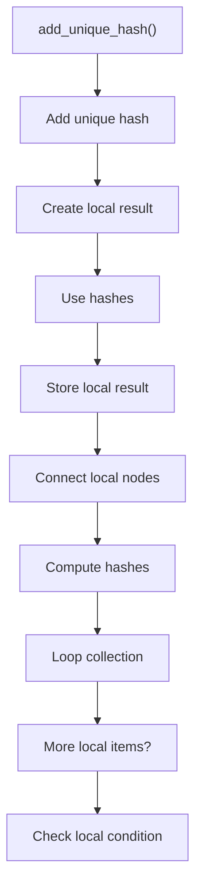
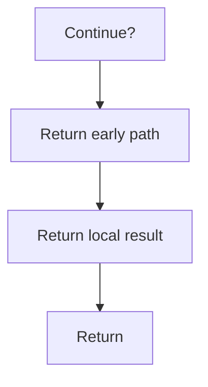

# add_unique_hash.cpp

- Source document: [hash.cpp.md](../../hash.cpp.md)
- Purpose: decoupled implementation logic for a future code unit.

### add_unique_hash()
This routine owns one focused piece of the file's behavior.

Inside the body, it mainly handles Create the local output structure, compute or reuse hash-oriented identifiers, store local findings, and connect local structures.

The implementation iterates over a collection or repeated workload. It branches on runtime conditions instead of following one fixed path. The caller receives a computed result or status from this step.

What it does:
- Create the local output structure
- compute or reuse hash-oriented identifiers
- store local findings
- connect local structures
- compute hash metadata
- walk the local collection
- branch on local conditions

Flow:

### Block 2 - add_unique_hash() Details
#### Slice 1 - Establish Local Entry
Quick summary: This slice shows the first file-local stage for add_unique_hash.cpp and keeps the diagram scoped to this code unit.
Why this is separate: add_unique_hash.cpp has multiple branches, loops, or stage changes, so this section is split out to keep one major intent visible at a time instead of forcing one oversized diagram.

#### Slice 2 - Handle Early Decisions
Quick summary: This slice shows the first local decision path for add_unique_hash.cpp after setup.
Why this is separate: add_unique_hash.cpp has multiple branches, loops, or stage changes, so this section is split out to keep one major intent visible at a time instead of forcing one oversized diagram.

