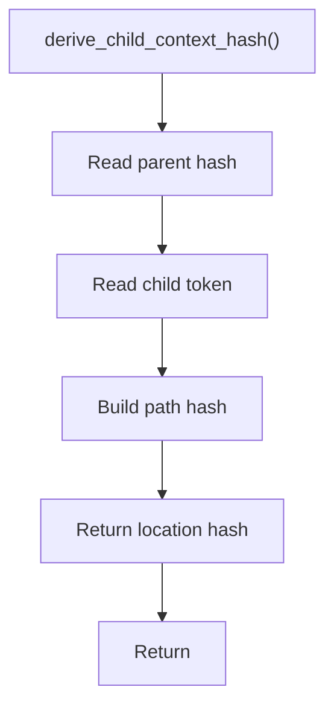

# derive_child_context_hash.cpp

- Source document: [hash.cpp.md](../../hash.cpp.md)
- Purpose: decoupled implementation logic for a future code unit.

### derive_child_context_hash()
This routine owns one focused piece of the file's behavior.

Inside the body, it mainly handles compute or reuse hash-oriented identifiers and compute hash metadata.

The caller receives a computed result or status from this step.

What it does:
- compute or reuse hash-oriented identifiers
- compute hash metadata

Implementation contract:
- Derive a child context hash from the immediate parent hash plus the child token or node identity.
- Use this hash to locate where a child function, statement, or lexeme lives under a head node.
- Do not treat the child hash as the registry pointer target. Registries point to class or function head nodes.
- For member functions, the child/member token must stay tied to the class or variable-resolved owner hash.

Flow:

