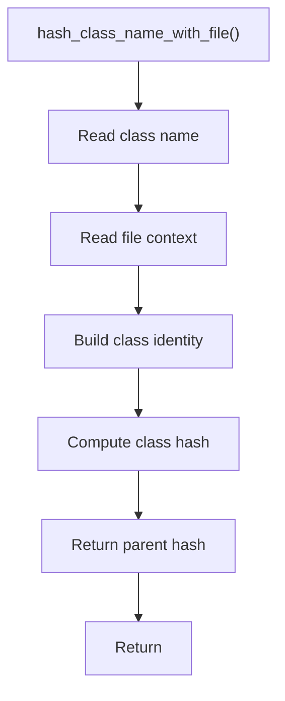

# hash_class_name_with_file.cpp

- Source document: [hash.cpp.md](../../hash.cpp.md)
- Purpose: decoupled implementation logic for a future code unit.

### hash_class_name_with_file()
This routine owns one focused piece of the file's behavior.

Inside the body, it mainly handles compute or reuse hash-oriented identifiers, inspect or register class-level information, and compute hash metadata.

The caller receives a computed result or status from this step.

What it does:
- compute or reuse hash-oriented identifiers
- inspect or register class-level information
- compute hash metadata

Implementation contract:
- Combine class name with file context before hashing when class names may repeat across files.
- This class hash is the parent identity used by member-function keys.
- A member name such as `speak` should resolve under this class hash, not through a bare member-name hash.

Flow:

