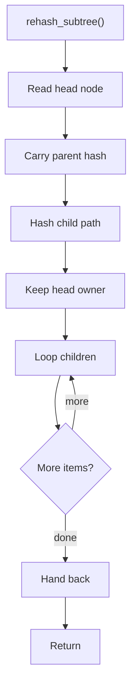

# rehash_subtree.cpp

- Source document: [hash.cpp.md](../../hash.cpp.md)
- Purpose: decoupled implementation logic for a future code unit.

### rehash_subtree()
This routine owns one focused piece of the file's behavior.

Inside the body, it mainly handles compute or reuse hash-oriented identifiers, connect local structures, compute hash metadata, and walk the local collection.

The implementation iterates over a collection or repeated workload.

What it does:
- compute or reuse hash-oriented identifiers
- connect local structures
- compute hash metadata
- walk the local collection

Implementation contract:
- Start from the subtree head node and cascade child path hashes beneath it.
- Preserve the head node as the registry pointer target.
- Use child hashes to recover exact nested location after the head is found.
- When the subtree contains member functions, carry the owning class/file context into descendant function keys.

Flow:

