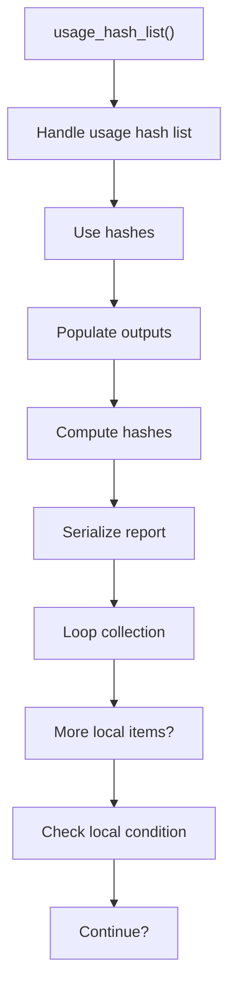
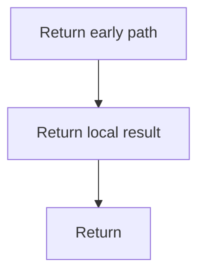

# usage_hash_list.cpp

- Source document: [hash.cpp.md](../../hash.cpp.md)
- Purpose: decoupled implementation logic for a future code unit.

### usage_hash_list()
This routine owns one focused piece of the file's behavior.

Inside the body, it mainly handles compute or reuse hash-oriented identifiers, fill local output fields, compute hash metadata, and serialize report content.

The implementation iterates over a collection or repeated workload. It branches on runtime conditions instead of following one fixed path. The caller receives a computed result or status from this step.

What it does:
- compute or reuse hash-oriented identifiers
- fill local output fields
- compute hash metadata
- serialize report content
- walk the local collection
- branch on local conditions

Flow:

### Block 4 - usage_hash_list() Details
#### Slice 1 - Establish Local Entry
Quick summary: This slice shows the first file-local stage for usage_hash_list.cpp and keeps the diagram scoped to this code unit.
Why this is separate: usage_hash_list.cpp has multiple branches, loops, or stage changes, so this section is split out to keep one major intent visible at a time instead of forcing one oversized diagram.

#### Slice 2 - Handle Early Decisions
Quick summary: This slice shows the first local decision path for usage_hash_list.cpp after setup.
Why this is separate: usage_hash_list.cpp has multiple branches, loops, or stage changes, so this section is split out to keep one major intent visible at a time instead of forcing one oversized diagram.

