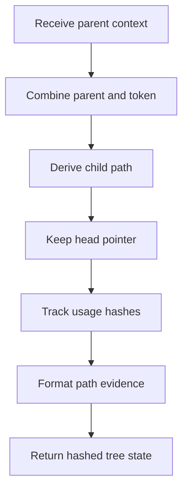

# core.cpp

- Source: Microservice/Modules/Source/ParseTree/Internal/hash.cpp
- Kind: C++ implementation
- Docs role: Reverse-Merkle hashing entrypoint for the future `HashingMechanism/ReverseMerkle/` source folder.

## Story
### What Happens Here

This file exists because reverse-Merkle hashing is a standalone algorithm stage in the parser pipeline. It owns the helpers that derive a child hash from the immediate parent, cascade contextual hashes through tree descendants, keep usage hashes unique, and format usage-hash evidence for output.

Registry ownership remains head-based. Reverse-Merkle child hashes tell later lookup where a nested function or lexeme is located under a head node; they do not create new registry owners for every child.

### Why It Matters In The Flow

Runs after tree nodes exist and before downstream hash-linking, reports, and rendered outputs consume the contextual hash state.

### What To Watch While Reading

Watch the parent-to-child hash handoff. The important symbols are `hash_combine_token`, `derive_child_context_hash`, `rehash_subtree`, `add_unique_hash`, `usage_hash_suffix`, and `usage_hash_list`.

For repeated names such as `speak`, the visible token hash is insufficient. The child context must carry the immediate parent hash, and class-level identity must include file context when the same class name can appear in multiple files.

## Program Flow
Quick summary: this file owns the local reverse-Merkle hash helpers used by parse-tree generation. It derives child context hashes from the immediate parent, cascades hashes through descendants, and formats usage-hash evidence for later readers.

Why this slice is separate: this diagram is the file-local activity path. The linked flow docs can expand individual helpers, but this file still needs to show what the implementation does as a whole.

Detailed helper flow is decoupled into future implementation units:

- [program_flow](./hash/hash_program_flow.cpp.md)
## Reading Map
Read this file as: reverse-Merkle hash propagation and usage-hash formatting.

Where it sits in the run: after actual/virtual tree nodes exist, before hash-link resolution and output generation.

Names worth recognizing while reading: hash_combine_token, make_fnv1a64_hash_id, std::setfill, derive_child_context_hash, hash_class_name_with_file, and rehash_subtree.

It leans on nearby contracts or tools such as `Internal/parse_tree_internal.hpp`, `cstdint`, `functional`, `iomanip`, `sstream`, and `string`.

## Story Groups

### Building The Working Picture
These steps assemble the trees, models, or bundles used by the rest of the file.
- rehash_subtree(): Compute or reuse hash-oriented identifiers, connect local structures, and compute hash metadata
- add_unique_hash(): Create the local output structure, compute or reuse hash-oriented identifiers, and store local findings

### Supporting Steps
These steps support the local behavior of the file.
- hash_combine_token(): Compute or reuse hash-oriented identifiers and compute hash metadata
- make_fnv1a64_hash_id(): Compute or reuse hash-oriented identifiers, fill local output fields, and compute hash metadata
- derive_child_context_hash(): Compute or reuse hash-oriented identifiers and compute hash metadata
- hash_class_name_with_file(): Compute or reuse hash-oriented identifiers, inspect or register class-level information, and compute hash metadata
- usage_hash_suffix(): Compute or reuse hash-oriented identifiers, fill local output fields, and compute hash metadata
- usage_hash_list(): Compute or reuse hash-oriented identifiers, fill local output fields, and compute hash metadata

## Function Stories
Function-level logic is decoupled into future implementation units:

- [hash_combine_token](./hash/functions/hash_combine_token.cpp.md)
- [make_fnv1a64_hash_id](./hash/functions/make_fnv1a64_hash_id.cpp.md)
- [derive_child_context_hash](./hash/functions/derive_child_context_hash.cpp.md)
- [hash_class_name_with_file](./hash/functions/hash_class_name_with_file.cpp.md)
- [rehash_subtree](./hash/functions/rehash_subtree.cpp.md)
- [add_unique_hash](./hash/functions/add_unique_hash.cpp.md)
- [usage_hash_suffix](./hash/functions/usage_hash_suffix.cpp.md)
- [usage_hash_list](./hash/functions/usage_hash_list.cpp.md)
## Documentation Note
- This markdown file is part of the generated docs/Codebase mirror.
- It was generated from the repository state on 2026-04-23 after reading the existing docs corpus and the current source tree.
