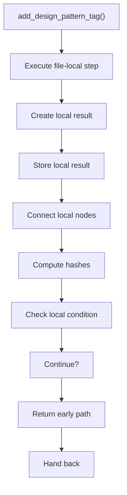

# add_design_pattern_tag.cpp

- Source document: [algorithm_pipeline.cpp.md](../../algorithm_pipeline.cpp.md)
- Purpose: decoupled implementation logic for a future code unit.

### add_design_pattern_tag()
This routine owns one focused piece of the file's behavior.

Inside the body, it mainly handles Create the local output structure, store local findings, connect local structures, and compute hash metadata.

It branches on runtime conditions instead of following one fixed path.

What it does:
- Create the local output structure
- store local findings
- connect local structures
- compute hash metadata
- branch on local conditions

Flow:

### Block 5 - add_design_pattern_tag() Details
#### Slice 1 - Establish Local Entry
Quick summary: This slice shows the first file-local stage for add_design_pattern_tag.cpp and keeps the diagram scoped to this code unit.
Why this is separate: add_design_pattern_tag.cpp has multiple branches, loops, or stage changes, so this section is split out to keep one major intent visible at a time instead of forcing one oversized diagram.

#### Slice 2 - Handle Early Decisions
Quick summary: This slice shows the first local decision path for add_design_pattern_tag.cpp after setup.
Why this is separate: add_design_pattern_tag.cpp has multiple branches, loops, or stage changes, so this section is split out to keep one major intent visible at a time instead of forcing one oversized diagram.

