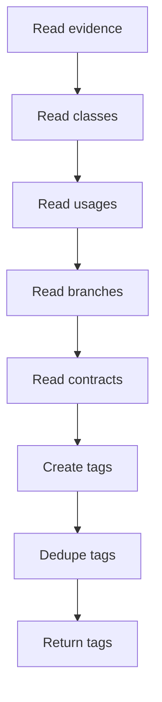

# build_design_pattern_tags.cpp

- Source document: [algorithm_pipeline.cpp.md](../../algorithm_pipeline.cpp.md)
- Purpose: build documentation-facing tags from detected design-pattern evidence.

## Story
### What Happens Here

`build_design_pattern_tags()` walks the detected design-pattern evidence and creates tags for code units that should be documented and used for unit-test generation. These tags are not refactor requests. They identify why a specific class, branch, contract method, factory invocation, or usage exists because of a detected pattern.

### Why It Matters In The Flow

Backend AI documentation depends on these tags to know which code excerpts must be included in the prompt. Unit-test generation also starts from the same evidence because the tests should cover pattern-specific behavior.

## Main Activity

Quick summary: Turn pattern evidence into documentation tags with stable target identities.

## Tag Meaning

Each tag should answer:
- what detected pattern the code belongs to.
- what code unit should be documented.
- why this code unit is pattern-specific.
- what hint should be passed to AI documentation.
- what evidence hash links the tag back to the analysis graph.

## Target Naming

The tag should expose a target identity usable by both documentation and unit-test generation. Prefer a deterministic ID built from:
- detected pattern.
- symbol name.
- tag type.
- evidence hash.

## Tag Output Fields

Required tag fields:
- `tag_id`
- `pattern`
- `tag_type`
- `file_path`
- `symbol_name`
- `node_kind`
- `node_value`
- `reason`
- `documentation_hint`
- `evidence_hash`
- `to_be_documented`

Do not emit `refactor_candidate` from this stage.

## Acceptance Checks

- Tags identify code to document, not code to refactor.
- Tags include enough local code context for backend AI prompt assembly.
- Tags can also feed unit-test target generation.
- Duplicate evidence produces one stable tag ID.
