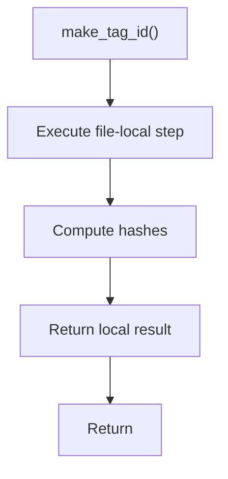

# make_tag_id.cpp

- Source document: [algorithm_pipeline.cpp.md](../../algorithm_pipeline.cpp.md)
- Purpose: decoupled implementation logic for a future code unit.

### make_tag_id()
This routine assembles a larger structure from the inputs it receives.

Inside the body, it mainly handles compute hash metadata.

The caller receives a computed result or status from this step.

What it does:
- compute hash metadata

Flow:

