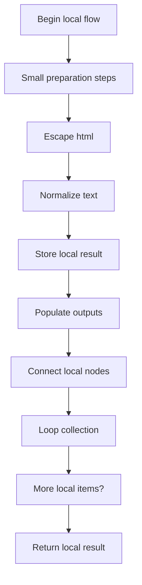
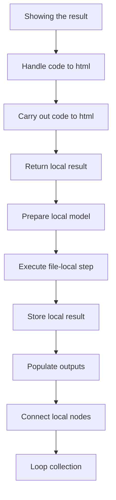
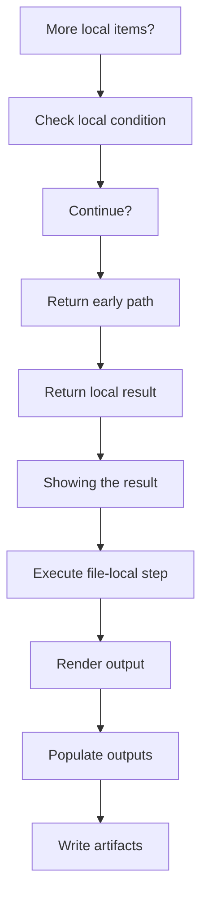
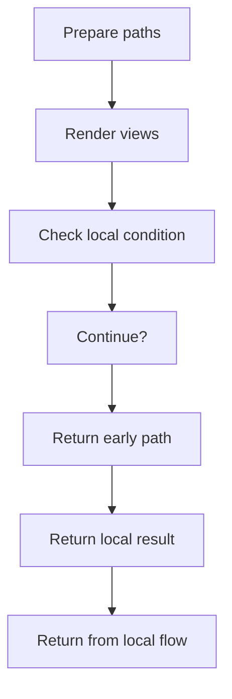
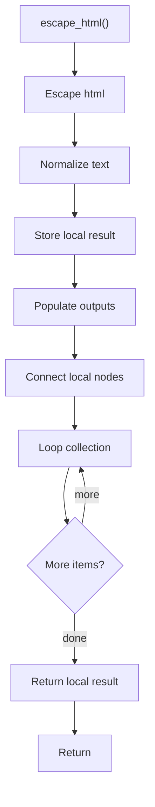
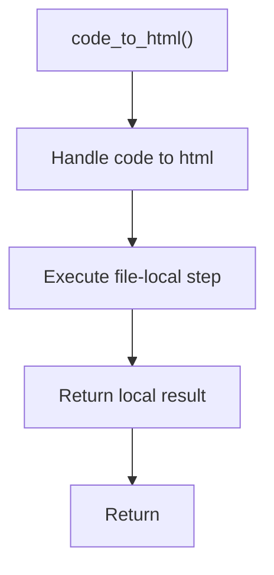
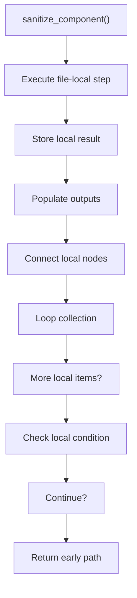
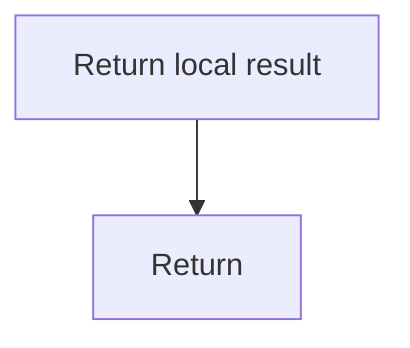
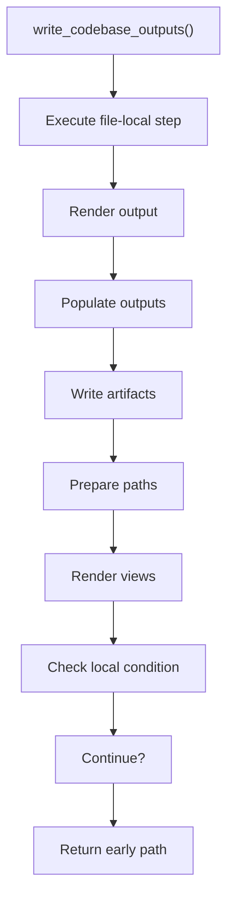

# codebase_output_writer.cpp

- Source: Microservice/Modules/Source/Output-and-Rendering/codebase_output_writer.cpp
- Kind: C++ implementation

## Story
### What Happens Here

This file keeps the older generated-code writer in one place. The current runtime path does not call it; it remains separate so output-writing behavior can be reviewed without mixing it into the tagging pipeline. This source file implements one of the generic middle-stage services in the C++ pipeline. It is executed after sources are loaded and before the final report and rendered outputs are written.

### Why It Matters In The Flow

Runs across the middle of the microservice flow to build parse trees, hash links, symbol tables, documentation tags, reports, and rendered outputs.

### What To Watch While Reading

Keeps the older generated-code writer isolated from the current tagging-focused runtime path. The main surface area is easiest to track through symbols such as escape_html, code_to_html, sanitize_component, and write_codebase_outputs. It collaborates directly with Output-and-Rendering/codebase_output_writer.hpp, filesystem, fstream, and cctype.

## Program Flow
This diagram follows the action path in plain words. Decision diamonds show where the file can stop, branch, or repeat work instead of simply passing through a straight line.

The flow is intentionally split into smaller slices so the major intent of codebase_output_writer.cpp stays readable. Each slice names the stage it is covering, gives a quick summary, and explains why that stage is separated from the next one.

### Program Flow Slices
#### Slice 1 - Establish Local Entry
Quick summary: This slice shows the first file-local stage for codebase_output_writer.cpp and keeps the diagram scoped to this code unit.
Why this is separate: codebase_output_writer.cpp has multiple branches, loops, or stage changes, so this section is split out to keep one major intent visible at a time instead of forcing one oversized diagram.

#### Slice 2 - Handle Early Decisions
Quick summary: This slice shows the first local decision path for codebase_output_writer.cpp after setup.
Why this is separate: codebase_output_writer.cpp has multiple branches, loops, or stage changes, so this section is split out to keep one major intent visible at a time instead of forcing one oversized diagram.

#### Slice 3 - Hand Off Local State
Quick summary: This slice shows how codebase_output_writer.cpp passes prepared local state into its next operation.
Why this is separate: codebase_output_writer.cpp has multiple branches, loops, or stage changes, so this section is split out to keep one major intent visible at a time instead of forcing one oversized diagram.

#### Slice 4 - Resolve Secondary Branch
Quick summary: This slice shows the next local decision path in codebase_output_writer.cpp and its immediate result.
Why this is separate: codebase_output_writer.cpp has multiple branches, loops, or stage changes, so this section is split out to keep one major intent visible at a time instead of forcing one oversized diagram.

## Reading Map
Read this file as: Keeps the older generated-code writer isolated from the current tagging-focused runtime path.

Where it sits in the run: Runs across the middle of the microservice flow to build parse trees, hash links, symbol tables, documentation tags, reports, and rendered outputs.

Names worth recognizing while reading: escape_html, code_to_html, sanitize_component, write_codebase_outputs, base_cpp, and target_cpp.

It leans on nearby contracts or tools such as Output-and-Rendering/codebase_output_writer.hpp, filesystem, fstream, cctype, and string.

## Story Groups

### Small Preparation Steps
These steps clean up names, text, or small values before the larger work begins.
- escape_html(): Normalize or format text values, store local findings, and fill local output fields

### Building The Working Picture
These steps assemble the trees, models, or bundles used by the rest of the file.
- sanitize_component(): store local findings, fill local output fields, and connect local structures

### Showing The Result
These steps turn internal state into text, HTML, JSON, or another output a reader can inspect.
- code_to_html(): Owns a focused local responsibility.
- write_codebase_outputs(): Render or serialize the result, fill local output fields, and write generated artifacts

## Function Stories

### escape_html()
This helper reshapes small pieces of data so the surrounding code can stay readable.

Inside the body, it mainly handles normalize or format text values, store local findings, fill local output fields, and connect local structures.

The implementation iterates over a collection or repeated workload. The caller receives a computed result or status from this step.

What it does:
- normalize or format text values
- store local findings
- fill local output fields
- connect local structures
- walk the local collection

Flow:

### code_to_html()
This routine owns one focused piece of the file's behavior.

The caller receives a computed result or status from this step.

What it does:
- This routine is primarily structural and does not expose obvious runtime operations from static inspection.

Flow:

### sanitize_component()
This routine owns one focused piece of the file's behavior.

Inside the body, it mainly handles store local findings, fill local output fields, connect local structures, and walk the local collection.

The implementation iterates over a collection or repeated workload. It branches on runtime conditions instead of following one fixed path. The caller receives a computed result or status from this step.

What it does:
- store local findings
- fill local output fields
- connect local structures
- walk the local collection
- branch on local conditions

Flow:

### Block 2 - sanitize_component() Details
#### Slice 1 - Establish Local Entry
Quick summary: This slice shows the first file-local stage for codebase_output_writer.cpp and keeps the diagram scoped to this code unit.
Why this is separate: codebase_output_writer.cpp has multiple branches, loops, or stage changes, so this section is split out to keep one major intent visible at a time instead of forcing one oversized diagram.

#### Slice 2 - Handle Early Decisions
Quick summary: This slice shows the first local decision path for codebase_output_writer.cpp after setup.
Why this is separate: codebase_output_writer.cpp has multiple branches, loops, or stage changes, so this section is split out to keep one major intent visible at a time instead of forcing one oversized diagram.

### write_codebase_outputs()
This routine materializes internal state into an output format that later stages can consume.

Inside the body, it mainly handles render or serialize the result, fill local output fields, write generated artifacts, and inspect or prepare filesystem paths.

It branches on runtime conditions instead of following one fixed path. The caller receives a computed result or status from this step.

What it does:
- render or serialize the result
- fill local output fields
- write generated artifacts
- inspect or prepare filesystem paths
- render text or HTML views
- branch on local conditions

Flow:

### Block 3 - write_codebase_outputs() Details
#### Slice 1 - Establish Local Entry
Quick summary: This slice shows the first file-local stage for codebase_output_writer.cpp and keeps the diagram scoped to this code unit.
Why this is separate: codebase_output_writer.cpp has multiple branches, loops, or stage changes, so this section is split out to keep one major intent visible at a time instead of forcing one oversized diagram.

#### Slice 2 - Handle Early Decisions
Quick summary: This slice shows the first local decision path for codebase_output_writer.cpp after setup.
Why this is separate: codebase_output_writer.cpp has multiple branches, loops, or stage changes, so this section is split out to keep one major intent visible at a time instead of forcing one oversized diagram.

## Documentation Note
- This markdown file is part of the generated docs/Codebase mirror.
- It was generated from the repository state on 2026-04-23 after reading the existing docs corpus and the current source tree.

