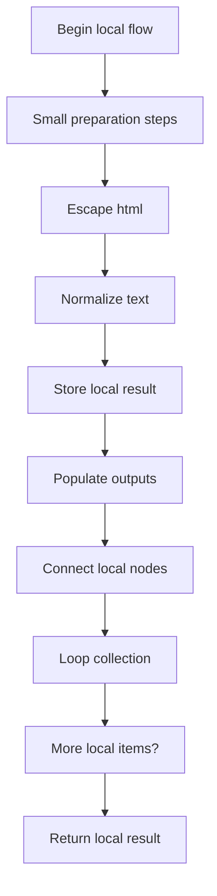
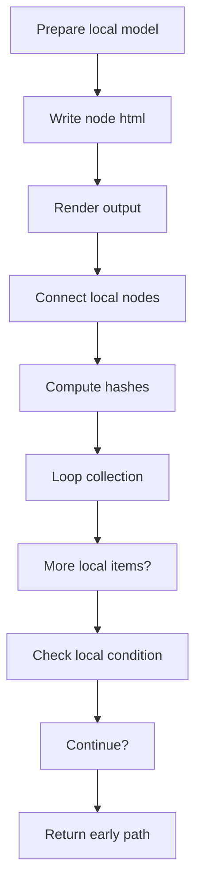
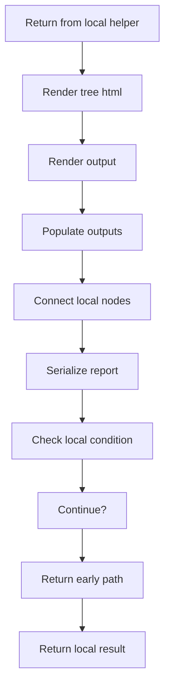
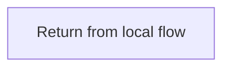
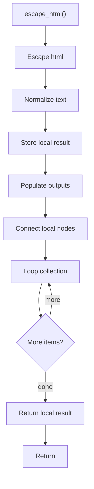
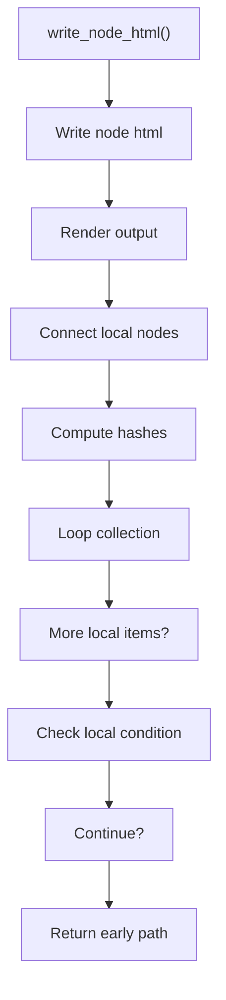
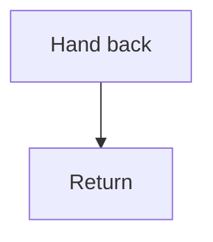
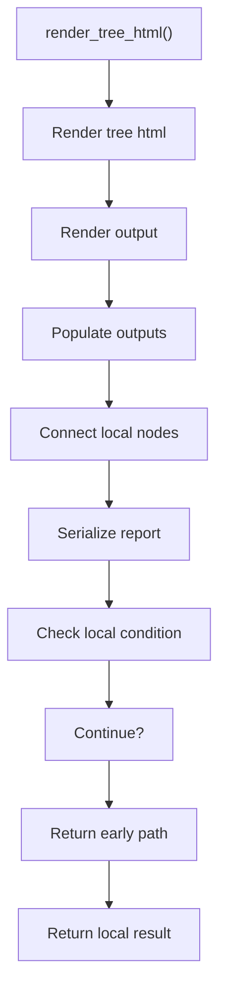
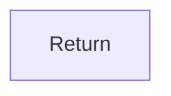

# tree_html_renderer.cpp

- Source: Microservice/Modules/Source/Output-and-Rendering/tree_html_renderer.cpp
- Kind: C++ implementation

## Story
### What Happens Here

This source file implements one of the generic middle-stage services in the C++ pipeline. It is executed after sources are loaded and before the final report and rendered outputs are written.

### Why It Matters In The Flow

Runs across the middle of the microservice flow to build parse trees, hash links, symbol tables, documentation tags, reports, and rendered outputs.

### What To Watch While Reading

Implements parsing, shadow-tree building, symbolization, hash linking, rendering, and reporting. The main surface area is easiest to track through symbols such as escape_html, write_node_html, and render_tree_html. It collaborates directly with Output-and-Rendering/tree_html_renderer.hpp and sstream.

## Program Flow
This diagram follows the action path in plain words. Decision diamonds show where the file can stop, branch, or repeat work instead of simply passing through a straight line.

The flow is intentionally split into smaller slices so the major intent of tree_html_renderer.cpp stays readable. Each slice names the stage it is covering, gives a quick summary, and explains why that stage is separated from the next one.

### Program Flow Slices
#### Slice 1 - Establish Local Entry
Quick summary: This slice shows the first file-local stage for tree_html_renderer.cpp and keeps the diagram scoped to this code unit.
Why this is separate: tree_html_renderer.cpp has multiple branches, loops, or stage changes, so this section is split out to keep one major intent visible at a time instead of forcing one oversized diagram.

#### Slice 2 - Handle Early Decisions
Quick summary: This slice shows the first local decision path for tree_html_renderer.cpp after setup.
Why this is separate: tree_html_renderer.cpp has multiple branches, loops, or stage changes, so this section is split out to keep one major intent visible at a time instead of forcing one oversized diagram.

#### Slice 3 - Hand Off Local State
Quick summary: This slice shows how tree_html_renderer.cpp passes prepared local state into its next operation.
Why this is separate: tree_html_renderer.cpp has multiple branches, loops, or stage changes, so this section is split out to keep one major intent visible at a time instead of forcing one oversized diagram.

#### Slice 4 - Resolve Secondary Branch
Quick summary: This slice shows the next local decision path in tree_html_renderer.cpp and its immediate result.
Why this is separate: tree_html_renderer.cpp has multiple branches, loops, or stage changes, so this section is split out to keep one major intent visible at a time instead of forcing one oversized diagram.

## Reading Map
Read this file as: Implements parsing, shadow-tree building, symbolization, hash linking, rendering, and reporting.

Where it sits in the run: Runs across the middle of the microservice flow to build parse trees, hash links, symbol tables, documentation tags, reports, and rendered outputs.

Names worth recognizing while reading: escape_html, write_node_html, and render_tree_html.

It leans on nearby contracts or tools such as Output-and-Rendering/tree_html_renderer.hpp and sstream.

## Story Groups

### Small Preparation Steps
These steps clean up names, text, or small values before the larger work begins.
- escape_html(): Normalize or format text values, store local findings, and fill local output fields

### Building The Working Picture
These steps assemble the trees, models, or bundles used by the rest of the file.
- write_node_html(): Render or serialize the result, connect local structures, and compute hash metadata
- render_tree_html(): Render or serialize the result, fill local output fields, and connect local structures

## Function Stories

### escape_html()
This helper reshapes small pieces of data so the surrounding code can stay readable.

Inside the body, it mainly handles normalize or format text values, store local findings, fill local output fields, and connect local structures.

The implementation iterates over a collection or repeated workload. The caller receives a computed result or status from this step.

What it does:
- normalize or format text values
- store local findings
- fill local output fields
- connect local structures
- walk the local collection

Flow:

### write_node_html()
This routine materializes internal state into an output format that later stages can consume.

Inside the body, it mainly handles render or serialize the result, connect local structures, compute hash metadata, and walk the local collection.

The implementation iterates over a collection or repeated workload. It branches on runtime conditions instead of following one fixed path.

What it does:
- render or serialize the result
- connect local structures
- compute hash metadata
- walk the local collection
- branch on local conditions

Flow:

### Block 2 - write_node_html() Details
#### Slice 1 - Establish Local Entry
Quick summary: This slice shows the first file-local stage for tree_html_renderer.cpp and keeps the diagram scoped to this code unit.
Why this is separate: tree_html_renderer.cpp has multiple branches, loops, or stage changes, so this section is split out to keep one major intent visible at a time instead of forcing one oversized diagram.

#### Slice 2 - Handle Early Decisions
Quick summary: This slice shows the first local decision path for tree_html_renderer.cpp after setup.
Why this is separate: tree_html_renderer.cpp has multiple branches, loops, or stage changes, so this section is split out to keep one major intent visible at a time instead of forcing one oversized diagram.

### render_tree_html()
This routine materializes internal state into an output format that later stages can consume.

Inside the body, it mainly handles render or serialize the result, fill local output fields, connect local structures, and serialize report content.

It branches on runtime conditions instead of following one fixed path. The caller receives a computed result or status from this step.

What it does:
- render or serialize the result
- fill local output fields
- connect local structures
- serialize report content
- branch on local conditions

Flow:

### Block 3 - render_tree_html() Details
#### Slice 1 - Establish Local Entry
Quick summary: This slice shows the first file-local stage for tree_html_renderer.cpp and keeps the diagram scoped to this code unit.
Why this is separate: tree_html_renderer.cpp has multiple branches, loops, or stage changes, so this section is split out to keep one major intent visible at a time instead of forcing one oversized diagram.

#### Slice 2 - Handle Early Decisions
Quick summary: This slice shows the first local decision path for tree_html_renderer.cpp after setup.
Why this is separate: tree_html_renderer.cpp has multiple branches, loops, or stage changes, so this section is split out to keep one major intent visible at a time instead of forcing one oversized diagram.

## Documentation Note
- This markdown file is part of the generated docs/Codebase mirror.
- It was generated from the repository state on 2026-04-23 after reading the existing docs corpus and the current source tree.

