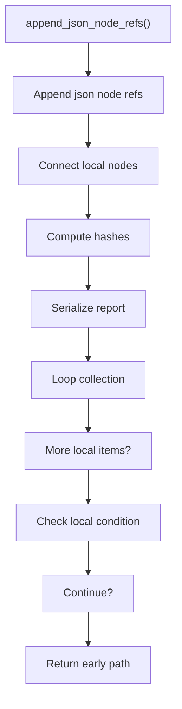
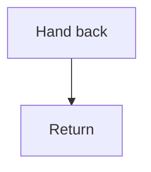

# append_json_node_refs.cpp

- Source document: [algorithm_pipeline.cpp.md](../../algorithm_pipeline.cpp.md)
- Purpose: decoupled implementation logic for a future code unit.

### append_json_node_refs()
This helper reshapes small pieces of data so the surrounding code can stay readable.

Inside the body, it mainly handles connect local structures, compute hash metadata, serialize report content, and walk the local collection.

The implementation iterates over a collection or repeated workload. It branches on runtime conditions instead of following one fixed path.

What it does:
- connect local structures
- compute hash metadata
- serialize report content
- walk the local collection
- branch on local conditions

Flow:

### Block 4 - append_json_node_refs() Details
#### Slice 1 - Establish Local Entry
Quick summary: This slice shows the first file-local stage for append_json_node_refs.cpp and keeps the diagram scoped to this code unit.
Why this is separate: append_json_node_refs.cpp has multiple branches, loops, or stage changes, so this section is split out to keep one major intent visible at a time instead of forcing one oversized diagram.

#### Slice 2 - Handle Early Decisions
Quick summary: This slice shows the first local decision path for append_json_node_refs.cpp after setup.
Why this is separate: append_json_node_refs.cpp has multiple branches, loops, or stage changes, so this section is split out to keep one major intent visible at a time instead of forcing one oversized diagram.

