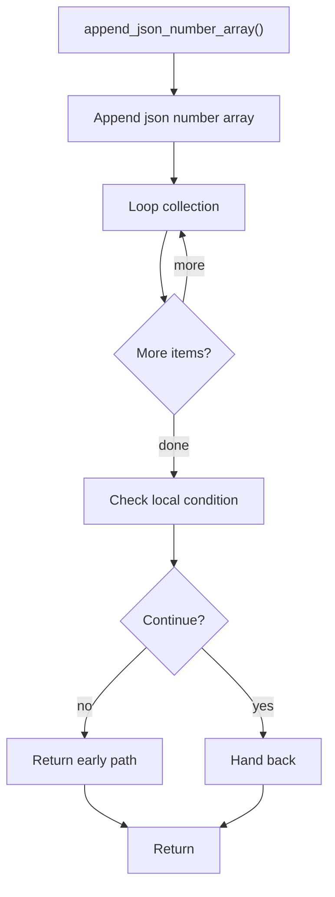

# append_json_number_array.cpp

- Source document: [algorithm_pipeline.cpp.md](../../algorithm_pipeline.cpp.md)
- Purpose: decoupled implementation logic for a future code unit.

### append_json_number_array()
This helper reshapes small pieces of data so the surrounding code can stay readable.

Inside the body, it mainly handles walk the local collection and branch on local conditions.

The implementation iterates over a collection or repeated workload. It branches on runtime conditions instead of following one fixed path.

What it does:
- walk the local collection
- branch on local conditions

Flow:

