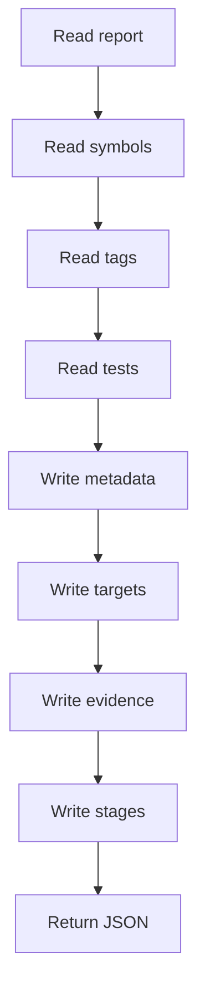
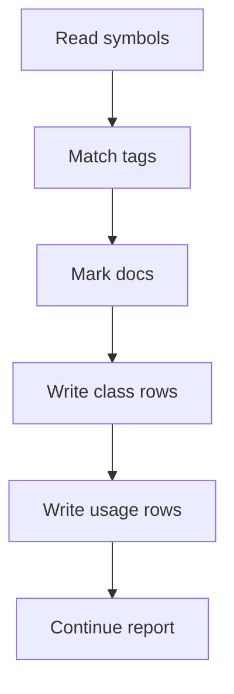
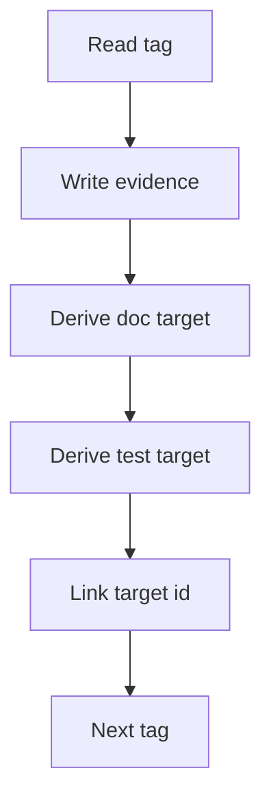

# pipeline_report_to_json.cpp

- Source document: [algorithm_pipeline.cpp.md](../../algorithm_pipeline.cpp.md)
- Purpose: structured JSON report assembly for detected design-pattern documentation and unit-test generation.

## Story
### What Happens Here

`pipeline_report_to_json()` serializes the completed analysis report. Its JSON should describe detected design-pattern evidence, documentation targets, unit-test targets, graph consistency, and cross-reference links.

The report should no longer describe a source-to-target transform. It should not emit refactor-candidate fields because the system is not refactoring code. The same evidence that used to be labeled as a refactor candidate is now a documentation and unit-test target.

### Why It Matters In The Flow

The backend uses this report to decide what code excerpts to send into AI documentation and what test cases should be generated. If the JSON uses old field names, backend and frontend code will show the wrong product behavior.

## Main Activity

Quick summary: Build the JSON from completed analysis artifacts and use documentation-oriented names.



## Required Top-Level Fields

```json
{
  "analysis_mode": "design_pattern_documentation",
  "detected_pattern": "factory",
  "input_file_count": 1,
  "total_elapsed_ms": 0,
  "graph_consistent": true,
  "documentation_target_count": 0,
  "unit_test_target_count": 0,
  "documentation_targets": [],
  "unit_test_targets": [],
  "design_pattern_tags": [],
  "stages": []
}
```

## Fields To Remove Or Rename

- Replace `source_pattern` with `detected_pattern` when serializing the live documentation report.
- Remove `target_pattern`; there is no target architecture selected by the user.
- Remove `code_generation_enabled`; documentation and unit-test generation are separate task outputs.
- Replace `refactor_candidate` with `to_be_documented`.
- Replace `refactor_candidate_class` with `documentation_target_class`.

## Documentation Target JSON

Each documentation target should include the code unit selected by the tagger and enough context for backend AI prompt assembly.

```json
{
  "target_id": "factory:Factory:create:branch-0",
  "to_be_documented": true,
  "detected_pattern": "factory",
  "tag_type": "factory_branch",
  "file_path": "Input/factory.cpp",
  "symbol_name": "Factory::create",
  "node_kind": "Branch",
  "node_value": "if (kind == \"A\") return new ProductA();",
  "documentation_hint": "Explain how this branch participates in Factory creation.",
  "evidence_hash": 12345
}
```

## Unit-Test Target JSON

Unit-test targets are generated from the same detected evidence, but they are serialized separately so frontend and backend consumers can display or process them independently.

```json
{
  "target_id": "factory:Factory:create:branch-0",
  "detected_pattern": "factory",
  "test_kind": "factory_branch_selection",
  "symbol_name": "Factory::create",
  "node_value": "if (kind == \"A\") return new ProductA();",
  "expected_behavior": "Selecting kind A creates ProductA.",
  "evidence_hash": 12345
}
```

## Split Stage: Symbol Registry

Quick summary: Class and usage registry entries should mark documentation relevance without refactor names.



Registry field rules:
- `documentation_tagged`: true when any design-pattern tag names the symbol.
- `to_be_documented`: true when the symbol or usage maps to a documentation target.
- `documentation_target_class`: true for class-name trace rows that feed documentation targets.
- no `refactor_candidate` fields.

## Split Stage: Design Pattern Tags

Quick summary: Tags remain the evidence layer, and targets are the task layer built from those tags.



## Acceptance Checks

- JSON has `analysis_mode: design_pattern_documentation`.
- JSON exposes `detected_pattern` instead of user-selected source/target pattern fields.
- JSON contains documentation targets with code excerpts.
- JSON contains unit-test targets derived from the same evidence.
- JSON does not contain `refactor_candidate` or `refactor_candidate_class`.
