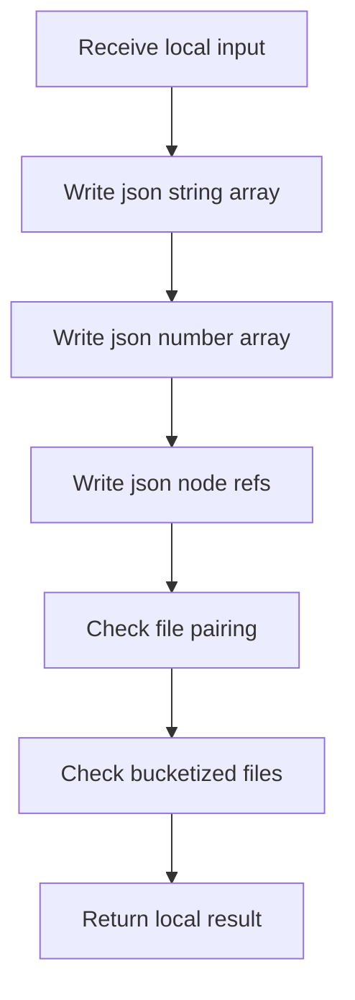

# algorithm_pipeline.cpp

- Source: Microservice/Modules/Source/Pipeline-Orchestration/algorithm_pipeline.cpp
- Kind: C++ implementation

## Story
### What Happens Here

This file implements the ordered core pipeline of the C++ system. It reads the source picture, builds the actual and virtual trees, detects pattern structure, links the evidence, tags the parts that deserve documentation, validates the graph, and returns one report-ready bundle to the application layer. This source file implements one of the generic middle-stage services in the C++ pipeline. It is executed after sources are loaded and before the final report and rendered outputs are written.

### Why It Matters In The Flow

Orchestrates the core analysis stages once source files have been loaded.

### What To Watch While Reading

Runs the ordered analysis pipeline and packages the resulting artifacts, documentation tags, traces, and metrics. The main surface area is easiest to track through symbols such as file_has_bucket_kind, validate_file_pairing, validate_bucketized_files, and estimate_parse_tree_bytes. It collaborates directly with Pipeline-Contracts/algorithm_pipeline.hpp, parse_tree_symbols.hpp, algorithm, and chrono.

## Program Flow
Quick summary: this diagram shows the file-local activity path for this implementation unit. It stays inside this code file and uses only entry and return boundaries as external references.

Why this slice is separate: deeper helper docs can explain individual functions, while this file still needs to show the main activity path in place.

Detailed program flow is decoupled into future implementation units:

- [program_flow_01](./algorithm_pipeline/algorithm_pipeline_program_flow_01.cpp.md)
- [program_flow_02](./algorithm_pipeline/algorithm_pipeline_program_flow_02.cpp.md)
## Reading Map
Read this file as: Runs the ordered analysis pipeline and packages the resulting artifacts, documentation tags, traces, and metrics.

Where it sits in the run: Orchestrates the core analysis stages once source files have been loaded.

Names worth recognizing while reading: file_has_bucket_kind, validate_file_pairing, validate_bucketized_files, estimate_parse_tree_bytes, estimate_creational_tree_bytes, and estimate_symbol_table_bytes.

It leans on nearby contracts or tools such as Pipeline-Contracts/algorithm_pipeline.hpp, parse_tree_symbols.hpp, algorithm, chrono, functional, and sstream.

## Story Groups

### Small Preparation Steps
These steps clean up names, text, or small values before the larger work begins.
- append_json_string_array(): Serialize report content, walk the local collection, and branch on local conditions
- append_json_number_array(): walk the local collection and branch on local conditions
- append_json_node_refs(): connect local structures, compute hash metadata, and serialize report content

### Checks Before Moving On
These steps stop bad input or unsupported state before it can confuse the next part of the run.
- validate_file_pairing(): Validate assumptions before continuing, store local findings, and connect local structures
- validate_bucketized_files(): Validate assumptions before continuing, store local findings, and connect local structures

### Building The Working Picture
These steps assemble the trees, models, or bundles used by the rest of the file.
- file_has_bucket_kind(): connect local structures, walk the local collection, and branch on local conditions
- estimate_parse_tree_bytes(): Estimate the size or cost of generated state, read local tokens, and connect local structures
- estimate_creational_tree_bytes(): Estimate the size or cost of generated state, connect local structures, and walk the local collection
- json_escape(): store local findings, fill local output fields, and connect local structures
- add_design_pattern_tag(): Create the local output structure, store local findings, and connect local structures
- build_design_pattern_tags(): Create the local output structure, compute hash metadata, and walk the local collection
- run_normalize_and_rewrite_pipeline(): Drive the main execution path, work one source line at a time, and store local findings
- pipeline_report_to_json(): Work one source line at a time, look up local indexes, and store local findings

### Supporting Steps
These steps support the local behavior of the file.
- estimate_symbol_table_bytes(): Estimate the size or cost of generated state, work with symbol-oriented state, and walk the local collection
- estimate_node_ref_bytes(): Estimate the size or cost of generated state, compute hash metadata, and walk the local collection
- estimate_hash_links_bytes(): Estimate the size or cost of generated state, compute or reuse hash-oriented identifiers, and compute hash metadata
- make_tag_id(): Compute hash metadata
- estimate_design_pattern_tag_bytes(): Estimate the size or cost of generated state and walk the local collection

## Function Stories
Function-level logic is decoupled into future implementation units:

- [file_has_bucket_kind](./algorithm_pipeline/functions/file_has_bucket_kind.cpp.md)
- [validate_file_pairing](./algorithm_pipeline/functions/validate_file_pairing.cpp.md)
- [validate_bucketized_files](./algorithm_pipeline/functions/validate_bucketized_files.cpp.md)
- [estimate_parse_tree_bytes](./algorithm_pipeline/functions/estimate_parse_tree_bytes.cpp.md)
- [estimate_creational_tree_bytes](./algorithm_pipeline/functions/estimate_creational_tree_bytes.cpp.md)
- [estimate_symbol_table_bytes](./algorithm_pipeline/functions/estimate_symbol_table_bytes.cpp.md)
- [estimate_node_ref_bytes](./algorithm_pipeline/functions/estimate_node_ref_bytes.cpp.md)
- [estimate_hash_links_bytes](./algorithm_pipeline/functions/estimate_hash_links_bytes.cpp.md)
- [json_escape](./algorithm_pipeline/functions/json_escape.cpp.md)
- [append_json_string_array](./algorithm_pipeline/functions/append_json_string_array.cpp.md)
- [append_json_number_array](./algorithm_pipeline/functions/append_json_number_array.cpp.md)
- [append_json_node_refs](./algorithm_pipeline/functions/append_json_node_refs.cpp.md)
- [make_tag_id](./algorithm_pipeline/functions/make_tag_id.cpp.md)
- [add_design_pattern_tag](./algorithm_pipeline/functions/add_design_pattern_tag.cpp.md)
- [build_design_pattern_tags](./algorithm_pipeline/functions/build_design_pattern_tags.cpp.md)
- [estimate_design_pattern_tag_bytes](./algorithm_pipeline/functions/estimate_design_pattern_tag_bytes.cpp.md)
- [run_normalize_and_rewrite_pipeline](./algorithm_pipeline/functions/run_normalize_and_rewrite_pipeline.cpp.md)
- [pipeline_report_to_json](./algorithm_pipeline/functions/pipeline_report_to_json.cpp.md)
## Documentation Note
- This markdown file is part of the generated docs/Codebase mirror.
- It was generated from the repository state on 2026-04-23 after reading the existing docs corpus and the current source tree.
