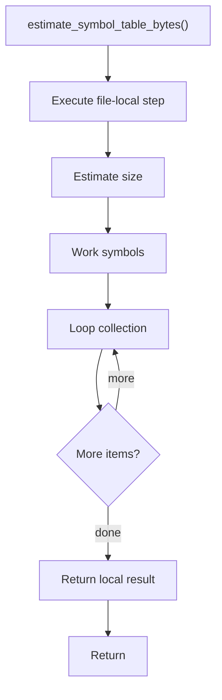

# estimate_symbol_table_bytes.cpp

- Source document: [algorithm_pipeline.cpp.md](../../algorithm_pipeline.cpp.md)
- Purpose: decoupled implementation logic for a future code unit.

### estimate_symbol_table_bytes()
This helper computes a size, count, or cost estimate used by surrounding logic.

Inside the body, it mainly handles estimate the size or cost of generated state, work with symbol-oriented state, and walk the local collection.

The implementation iterates over a collection or repeated workload. The caller receives a computed result or status from this step.

What it does:
- estimate the size or cost of generated state
- work with symbol-oriented state
- walk the local collection

Flow:

