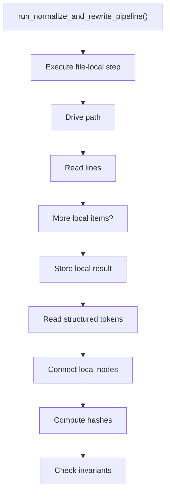
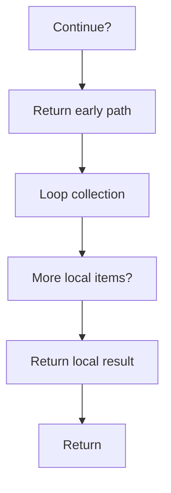

# run_normalize_and_rewrite_pipeline.cpp

- Source document: [algorithm_pipeline.cpp.md](../../algorithm_pipeline.cpp.md)
- Purpose: decoupled implementation logic for a future code unit.

### run_normalize_and_rewrite_pipeline()
This routine prepares or drives one of the main execution paths in the file.

Inside the body, it mainly handles drive the main execution path, work one source line at a time, store local findings, and read local tokens.

The implementation iterates over a collection or repeated workload. It branches on runtime conditions instead of following one fixed path. The caller receives a computed result or status from this step.

What it does:
- drive the main execution path
- work one source line at a time
- store local findings
- read local tokens
- connect local structures
- compute hash metadata
- validate pipeline invariants
- walk the local collection
- branch on local conditions

Flow:

### Block 7 - run_normalize_and_rewrite_pipeline() Details
#### Slice 1 - Establish Local Entry
Quick summary: This slice shows the first file-local stage for run_normalize_and_rewrite_pipeline.cpp and keeps the diagram scoped to this code unit.
Why this is separate: run_normalize_and_rewrite_pipeline.cpp has multiple branches, loops, or stage changes, so this section is split out to keep one major intent visible at a time instead of forcing one oversized diagram.

#### Slice 2 - Handle Early Decisions
Quick summary: This slice shows the first local decision path for run_normalize_and_rewrite_pipeline.cpp after setup.
Why this is separate: run_normalize_and_rewrite_pipeline.cpp has multiple branches, loops, or stage changes, so this section is split out to keep one major intent visible at a time instead of forcing one oversized diagram.

