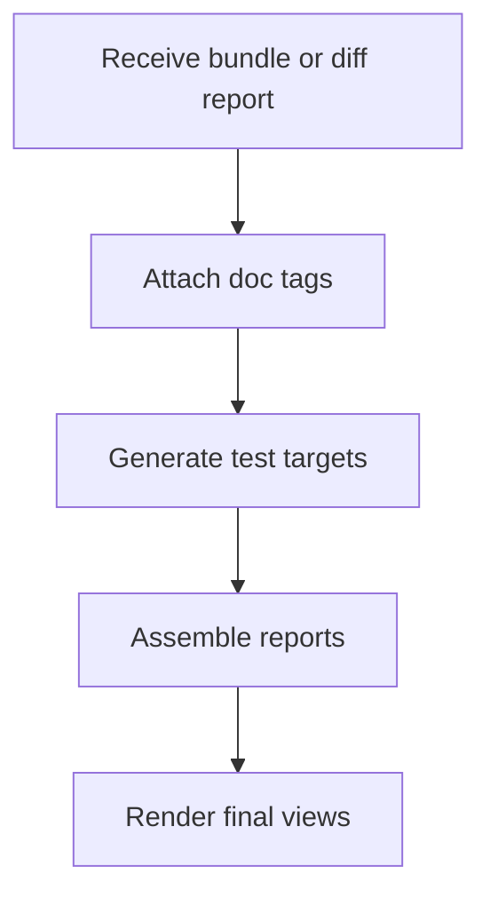

# `core.cpp`

- Folder: `docs/Codebase/Microservice/Modules/Source/OutputGeneration`
- Role: stage-wide workflow for everything emitted after analysis, trees, and hash resolution are complete

## Start Here
- Read this file first for the output-stage workflow.
- Then read `DocumentationTagger/`, `UnitTestGeneration/`, `Report/`, and `Render/` in that order.

## Quick Summary
- This stage packages the analyzed bundle or interval regeneration report into concrete outputs.
- It keeps future unit-test generation, documentation tagging, structured reports, and rendered views as separate output paths.

## Why This Stage Is Separate
- `Analysis/`, `Trees/`, `HashingMechanism/`, and `Diffing/` prepare the internal understanding of the codebase.
- `OutputGeneration/` turns that internal understanding into emitted artifacts.

## Major Workflow

## Handoff
- Receives resolved tree and identity results from `../HashingMechanism/core.cpp.md`.
- Receives interval regeneration reports from `../Diffing/core.cpp.md` when auto-checking is active.
- Produces the final outward-facing artifacts for downstream implementation and validation.

## Local Ownership
- `DocumentationTagger/` owns documentation-facing pattern tags.
- `UnitTestGeneration/` owns unit-test targets derived from documentation-facing pattern evidence.
- `Report/` owns structured report assembly.
- `Render/` owns HTML or other rendered views.

## Acceptance Checks
- Unit-test generation stays separate from reports and rendering.
- Documentation tagging is visible as its own output path.
- Output names use documentation and unit-test target language instead of refactor language.
- The whole output stage is readable from one entry file.
