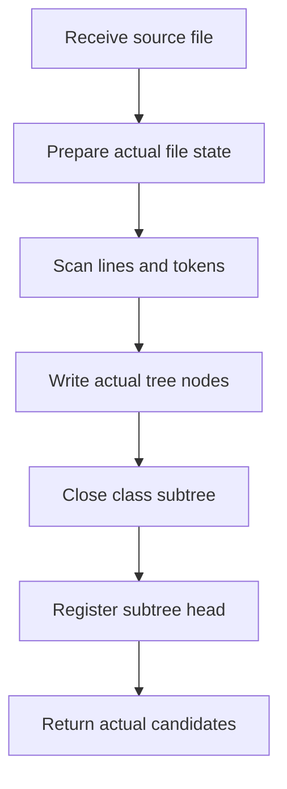

# build.cpp

- Source: `Codebase/Microservice/Modules/Source/SyntacticBrokenAST/ParseTree/Internal/build.cpp`
- Kind: C++ implementation blueprint
- Local role: build file-local actual parse-tree nodes and emit completed class-declaration subtree candidates.

## Read First

This file is the line parser for the actual class-generation path. It reads source text one file at a time, creates actual parse-tree nodes under the already attached file node, records hash traces, and emits completed class-declaration subtree candidates for later structural pattern analysis.

The important distinction is that the actual parse tree is always written into the file-local tree first. Virtual-broken evidence is not the driver of this file; it is assembled later from a completed class subtree that matched a pattern scaffold.

## File-Level Flow

Quick summary: this is the local workflow inside `build.cpp`. It starts from one source file and exits with the actual file node plus class-subtree candidates for the caller.

Why this slice is separate: this diagram shows how this file's responsibilities connect. Function internals are documented in the lower sections instead of being repeated here.

## Function Map

- `parse_file_content_into_node(...)`: parses one file into the actual file node and records completed class-declaration subtree candidates.
- `initialize_actual_file_state(...)`: prepares actual file-root bookkeeping for class-subtree generation.
- `begin_actual_class_subtree(...)`: starts a class subtree after lexical structure detection finds a class candidate.
- `append_actual_candidate_node(...)`: writes eligible statement nodes into the actual class subtree.
- `enter_actual_scope(...)` and `exit_actual_scope(...)`: keep actual scope depth aligned with brace scopes.
- `finalize_actual_class_subtree(...)`: marks a completed class subtree as ready for pattern analysis.
- `collect_class_definitions_by_file(...)`: maps class or struct declarations to the file where they were defined.
- `collect_symbol_dependencies_for_file(...)`: emits cross-file symbol dependency nodes from class-name usage.
- `resolve_include_dependencies(...)`: rewrites include dependency nodes from basename-only to basename plus resolved path.

## Detailed Flow Docs

These files break down the large local workflow without duplicating the main diagram:

- [build_program_flow_01.cpp.md](./Build/Flow/build_program_flow_01.cpp.md): line parsing, actual node writes, and completed class-subtree candidate handling.
- [build_program_flow_02.cpp.md](./Build/Flow/build_program_flow_02.cpp.md): post-parse dependency extraction and include resolution.

## Local Boundaries

This file owns:

- actual statement and block node construction for a single source file
- line-level hash trace collection
- factory callsite trace collection
- completed class-declaration subtree lifecycle while parsing a class
- class definition discovery, symbol dependency extraction, and include dependency resolution

This file does not own:

- source entry orchestration across many files
- root main-tree creation
- final output rendering
- structural pattern rule definitions inside the pattern catalog and hooks

## Acceptance Checks

- File-level Mermaid shows only this file's workflow and uses no generic action-bucket nodes.
- Function names appear in prose headings or maps, not as the main action labels inside Mermaid nodes.
- The actual tree and class-declaration subtree candidates are shown as the prerequisite output for pattern analysis.
- Cross-file references appear only as source path and caller/callee boundary notes.
