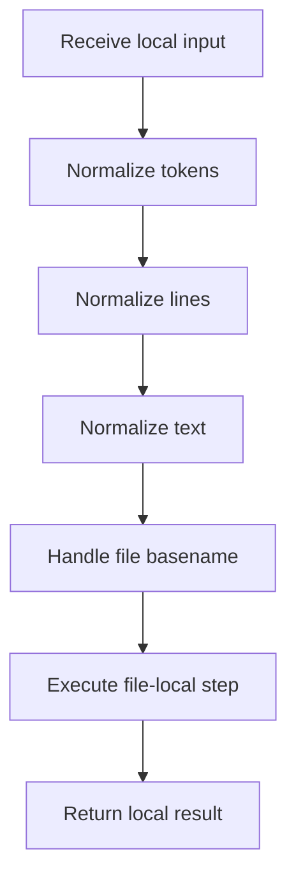

# line.cpp

- Source: Microservice/Modules/Source/ParseTree/Internal/line.cpp
- Kind: C++ implementation

## Story
### What Happens Here

This source file implements one internal part of the generic parse-tree engine. It contributes specialized behavior such as dependency handling, symbolization, hash-link construction, rendering, or older generation helpers after the raw tree exists. This source file implements one of the generic middle-stage services in the C++ pipeline. It is executed after sources are loaded and before the final report and rendered outputs are written.

### Why It Matters In The Flow

Runs across the middle of the microservice flow to build parse trees, hash links, symbol tables, documentation tags, reports, and rendered outputs.

### What To Watch While Reading

Implements parsing, shadow-tree building, symbolization, hash linking, rendering, and reporting. The main surface area is easiest to track through symbols such as tokenize_text, join_tokens, split_lines, and file_basename. It collaborates directly with Internal/parse_tree_internal.hpp, Language-and-Structure/language_tokens.hpp, cctype, and sstream.

## Program Flow
Quick summary: this diagram shows the file-local activity path for this implementation unit. It stays inside this code file and uses only entry and return boundaries as external references.

Why this slice is separate: deeper helper docs can explain individual functions, while this file still needs to show the main activity path in place.

Detailed program flow is decoupled into future implementation units:

- [program_flow](./line/line_program_flow.cpp.md)
## Reading Map
Read this file as: Implements parsing, shadow-tree building, symbolization, hash linking, rendering, and reporting.

Where it sits in the run: Runs across the middle of the microservice flow to build parse trees, hash links, symbol tables, documentation tags, reports, and rendered outputs.

Names worth recognizing while reading: tokenize_text, join_tokens, split_lines, file_basename, and include_target_from_line.

It leans on nearby contracts or tools such as Internal/parse_tree_internal.hpp, Language-and-Structure/language_tokens.hpp, cctype, sstream, string, and vector.

## Story Groups

### Small Preparation Steps
These steps clean up names, text, or small values before the larger work begins.
- join_tokens(): fill local output fields, serialize report content, and walk the local collection
- split_lines(): Split source text into smaller units, work one source line at a time, and store local findings

### Reading The Input
These steps turn raw text or arguments into something the program can follow.
- tokenize_text(): Split source text into smaller units, store local findings, and normalize raw text before later parsing

### Supporting Steps
These steps support the local behavior of the file.
- file_basename(): Normalize raw text before later parsing and branch on local conditions
- include_target_from_line(): Work one source line at a time, read local tokens, and walk the local collection

## Function Stories
Function-level logic is decoupled into future implementation units:

- [tokenize_text](./line/functions/tokenize_text.cpp.md)
- [join_tokens](./line/functions/join_tokens.cpp.md)
- [split_lines](./line/functions/split_lines.cpp.md)
- [file_basename](./line/functions/file_basename.cpp.md)
- [include_target_from_line](./line/functions/include_target_from_line.cpp.md)
## Documentation Note
- This markdown file is part of the generated docs/Codebase mirror.
- It was generated from the repository state on 2026-04-23 after reading the existing docs corpus and the current source tree.
