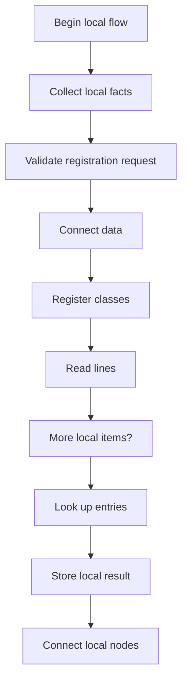
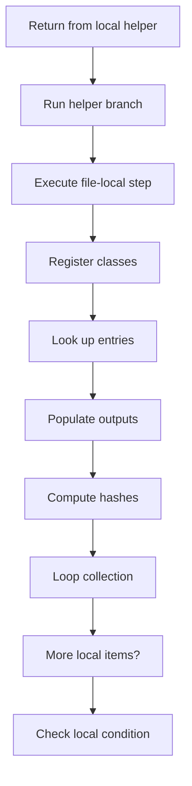
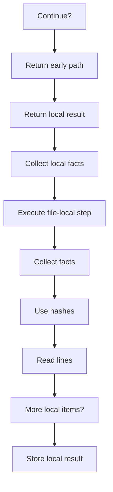
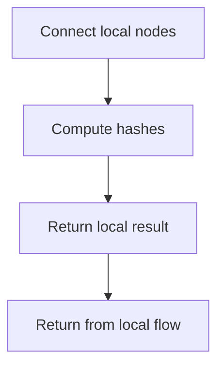
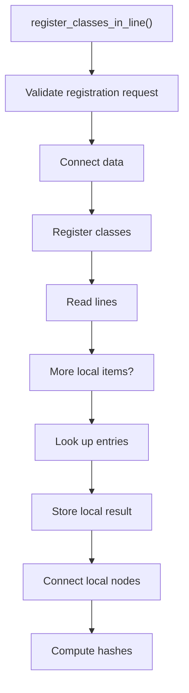
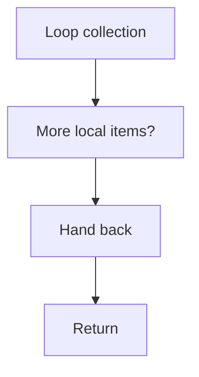
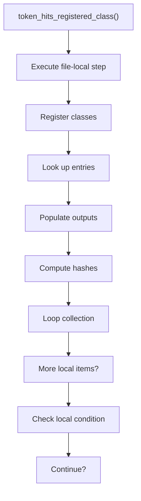
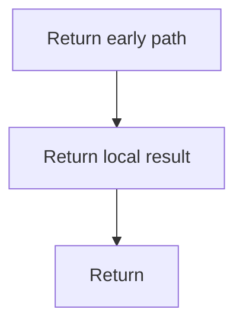
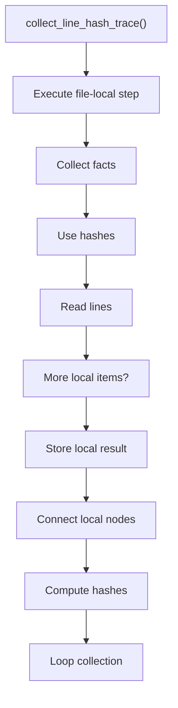
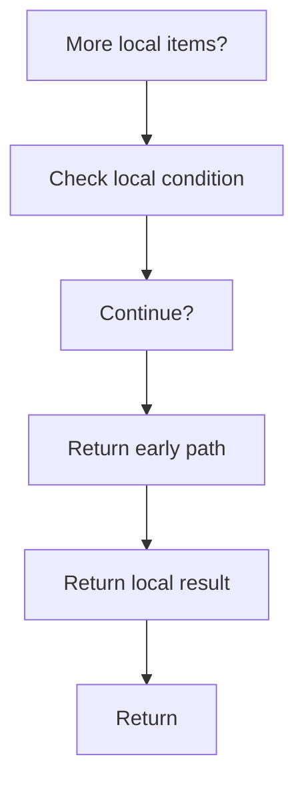

# registry.cpp

- Source: Microservice/Modules/Source/ParseTree/Internal/registry.cpp
- Kind: C++ implementation

## Story
### What Happens Here

This source file implements one internal part of the generic parse-tree engine. It contributes specialized behavior such as dependency handling, symbolization, hash-link construction, rendering, or older generation helpers after the raw tree exists. This source file implements one of the generic middle-stage services in the C++ pipeline. It is executed after sources are loaded and before the final report and rendered outputs are written.

### Why It Matters In The Flow

Runs across the middle of the microservice flow to build parse trees, hash links, symbol tables, documentation tags, reports, and rendered outputs.

### What To Watch While Reading

Implements parsing, shadow-tree building, symbolization, hash linking, rendering, and reporting. The main surface area is easiest to track through symbols such as register_classes_in_line, token_hits_registered_class, and collect_line_hash_trace. It collaborates directly with Internal/parse_tree_internal.hpp, Language-and-Structure/language_tokens.hpp, Language-and-Structure/lexical_structure_hooks.hpp, and functional.

## Program Flow
This diagram follows the action path in plain words. Decision diamonds show where the file can stop, branch, or repeat work instead of simply passing through a straight line.

The flow is intentionally split into smaller slices so the major intent of registry.cpp stays readable. Each slice names the stage it is covering, gives a quick summary, and explains why that stage is separated from the next one.

### Program Flow Slices
#### Slice 1 - Establish Local Entry
Quick summary: This slice shows the first file-local stage for registry.cpp and keeps the diagram scoped to this code unit.
Why this is separate: registry.cpp has multiple branches, loops, or stage changes, so this section is split out to keep one major intent visible at a time instead of forcing one oversized diagram.

#### Slice 2 - Handle Early Decisions
Quick summary: This slice shows the first local decision path for registry.cpp after setup.
Why this is separate: registry.cpp has multiple branches, loops, or stage changes, so this section is split out to keep one major intent visible at a time instead of forcing one oversized diagram.

#### Slice 3 - Hand Off Local State
Quick summary: This slice shows how registry.cpp passes prepared local state into its next operation.
Why this is separate: registry.cpp has multiple branches, loops, or stage changes, so this section is split out to keep one major intent visible at a time instead of forcing one oversized diagram.

#### Slice 4 - Resolve Secondary Branch
Quick summary: This slice shows the next local decision path in registry.cpp and its immediate result.
Why this is separate: registry.cpp has multiple branches, loops, or stage changes, so this section is split out to keep one major intent visible at a time instead of forcing one oversized diagram.

## Reading Map
Read this file as: Implements parsing, shadow-tree building, symbolization, hash linking, rendering, and reporting.

Where it sits in the run: Runs across the middle of the microservice flow to build parse trees, hash links, symbol tables, documentation tags, reports, and rendered outputs.

Names worth recognizing while reading: register_classes_in_line, token_hits_registered_class, and collect_line_hash_trace.

It leans on nearby contracts or tools such as Internal/parse_tree_internal.hpp, Language-and-Structure/language_tokens.hpp, Language-and-Structure/lexical_structure_hooks.hpp, functional, string, and utility.

## Story Groups

### Finding What Matters
These steps pick out the facts, traces, and relationships that later stages need.
- register_classes_in_line(): Connect discovered data back into the shared model, inspect or register class-level information, and work one source line at a time
- collect_line_hash_trace(): Collect derived facts for later stages, compute or reuse hash-oriented identifiers, and work one source line at a time

### Supporting Steps
These steps support the local behavior of the file.
- token_hits_registered_class(): Inspect or register class-level information, look up local indexes, and fill local output fields

## Function Stories

### register_classes_in_line()
This routine connects discovered items back into the broader model owned by the file.

Inside the body, it mainly handles connect discovered data back into the shared model, inspect or register class-level information, work one source line at a time, and look up local indexes.

The implementation iterates over a collection or repeated workload. It branches on runtime conditions instead of following one fixed path.

What it does:
- connect discovered data back into the shared model
- inspect or register class-level information
- work one source line at a time
- look up local indexes
- store local findings
- connect local structures
- compute hash metadata
- walk the local collection
- branch on local conditions

Flow:

### Block 2 - register_classes_in_line() Details
#### Slice 1 - Establish Local Entry
Quick summary: This slice shows the first file-local stage for registry.cpp and keeps the diagram scoped to this code unit.
Why this is separate: registry.cpp has multiple branches, loops, or stage changes, so this section is split out to keep one major intent visible at a time instead of forcing one oversized diagram.

#### Slice 2 - Handle Early Decisions
Quick summary: This slice shows the first local decision path for registry.cpp after setup.
Why this is separate: registry.cpp has multiple branches, loops, or stage changes, so this section is split out to keep one major intent visible at a time instead of forcing one oversized diagram.

### token_hits_registered_class()
This routine owns one focused piece of the file's behavior.

Inside the body, it mainly handles inspect or register class-level information, look up local indexes, fill local output fields, and compute hash metadata.

The implementation iterates over a collection or repeated workload. It branches on runtime conditions instead of following one fixed path. The caller receives a computed result or status from this step.

What it does:
- inspect or register class-level information
- look up local indexes
- fill local output fields
- compute hash metadata
- walk the local collection
- branch on local conditions

Flow:

### Block 3 - token_hits_registered_class() Details
#### Slice 1 - Establish Local Entry
Quick summary: This slice shows the first file-local stage for registry.cpp and keeps the diagram scoped to this code unit.
Why this is separate: registry.cpp has multiple branches, loops, or stage changes, so this section is split out to keep one major intent visible at a time instead of forcing one oversized diagram.

#### Slice 2 - Handle Early Decisions
Quick summary: This slice shows the first local decision path for registry.cpp after setup.
Why this is separate: registry.cpp has multiple branches, loops, or stage changes, so this section is split out to keep one major intent visible at a time instead of forcing one oversized diagram.

### collect_line_hash_trace()
This routine connects discovered items back into the broader model owned by the file.

Inside the body, it mainly handles collect derived facts for later stages, compute or reuse hash-oriented identifiers, work one source line at a time, and store local findings.

The implementation iterates over a collection or repeated workload. It branches on runtime conditions instead of following one fixed path. The caller receives a computed result or status from this step.

What it does:
- collect derived facts for later stages
- compute or reuse hash-oriented identifiers
- work one source line at a time
- store local findings
- connect local structures
- compute hash metadata
- walk the local collection
- branch on local conditions

Flow:

### Block 4 - collect_line_hash_trace() Details
#### Slice 1 - Establish Local Entry
Quick summary: This slice shows the first file-local stage for registry.cpp and keeps the diagram scoped to this code unit.
Why this is separate: registry.cpp has multiple branches, loops, or stage changes, so this section is split out to keep one major intent visible at a time instead of forcing one oversized diagram.

#### Slice 2 - Handle Early Decisions
Quick summary: This slice shows the first local decision path for registry.cpp after setup.
Why this is separate: registry.cpp has multiple branches, loops, or stage changes, so this section is split out to keep one major intent visible at a time instead of forcing one oversized diagram.

## Documentation Note
- This markdown file is part of the generated docs/Codebase mirror.
- It was generated from the repository state on 2026-04-23 after reading the existing docs corpus and the current source tree.

