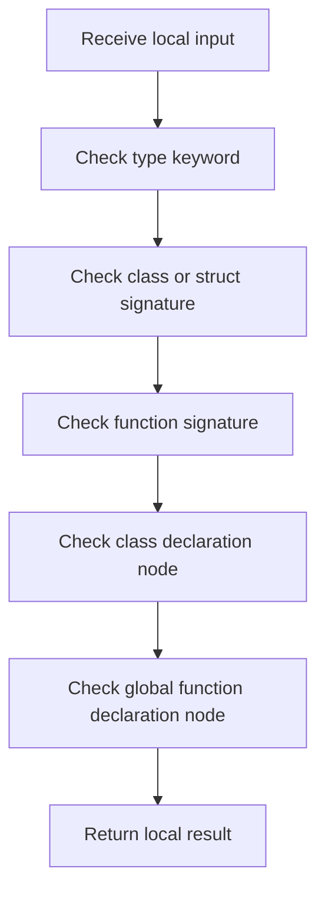

# statement.cpp

- Source: Microservice/Modules/Source/ParseTree/Internal/statement.cpp
- Kind: C++ implementation

## Story
### What Happens Here

This source file implements one internal part of the generic parse-tree engine. It contributes specialized behavior such as dependency handling, symbolization, hash-link construction, rendering, or older generation helpers after the raw tree exists. This source file implements one of the generic middle-stage services in the C++ pipeline. It is executed after sources are loaded and before the final report and rendered outputs are written.

### Why It Matters In The Flow

Runs across the middle of the microservice flow to build parse trees, hash links, symbol tables, documentation tags, reports, and rendered outputs.

### What To Watch While Reading

Implements parsing, shadow-tree building, symbolization, hash linking, rendering, and reporting. The main surface area is easiest to track through symbols such as is_type_keyword, detect_statement_kind, is_class_or_struct_signature, and is_function_signature. It collaborates directly with Internal/parse_tree_internal.hpp, Language-and-Structure/language_tokens.hpp, string, and vector.

## Program Flow
Quick summary: this diagram shows the file-local activity path for this implementation unit. It stays inside this code file and uses only entry and return boundaries as external references.

Why this slice is separate: deeper helper docs can explain individual functions, while this file still needs to show the main activity path in place.

Detailed program flow is decoupled into future implementation units:

- [program_flow](./statement/statement_program_flow.cpp.md)
## Reading Map
Read this file as: Implements parsing, shadow-tree building, symbolization, hash linking, rendering, and reporting.

Where it sits in the run: Runs across the middle of the microservice flow to build parse trees, hash links, symbol tables, documentation tags, reports, and rendered outputs.

Names worth recognizing while reading: is_type_keyword, detect_statement_kind, is_class_or_struct_signature, is_function_signature, is_class_declaration_node, and is_global_function_declaration_node.

It leans on nearby contracts or tools such as Internal/parse_tree_internal.hpp, Language-and-Structure/language_tokens.hpp, string, and vector.

## Story Groups

### Checks Before Moving On
These steps stop bad input or unsupported state before it can confuse the next part of the run.
- is_type_keyword(): look up local indexes
- is_class_or_struct_signature(): Inspect or register class-level information, look up local indexes, and read local tokens
- is_function_signature(): look up local indexes, read local tokens, and walk the local collection
- is_class_declaration_node(): Inspect or register class-level information, inspect or rewrite declarations, and branch on local conditions
- is_global_function_declaration_node(): Inspect or rewrite declarations

### Supporting Steps
These steps support the local behavior of the file.
- detect_statement_kind(): look up local indexes, walk the local collection, and branch on local conditions

## Function Stories
Function-level logic is decoupled into future implementation units:

- [is_type_keyword](./statement/functions/is_type_keyword.cpp.md)
- [detect_statement_kind](./statement/functions/detect_statement_kind.cpp.md)
- [is_class_or_struct_signature](./statement/functions/is_class_or_struct_signature.cpp.md)
- [is_function_signature](./statement/functions/is_function_signature.cpp.md)
- [is_class_declaration_node](./statement/functions/is_class_declaration_node.cpp.md)
- [is_global_function_declaration_node](./statement/functions/is_global_function_declaration_node.cpp.md)
## Documentation Note
- This markdown file is part of the generated docs/Codebase mirror.
- It was generated from the repository state on 2026-04-23 after reading the existing docs corpus and the current source tree.
