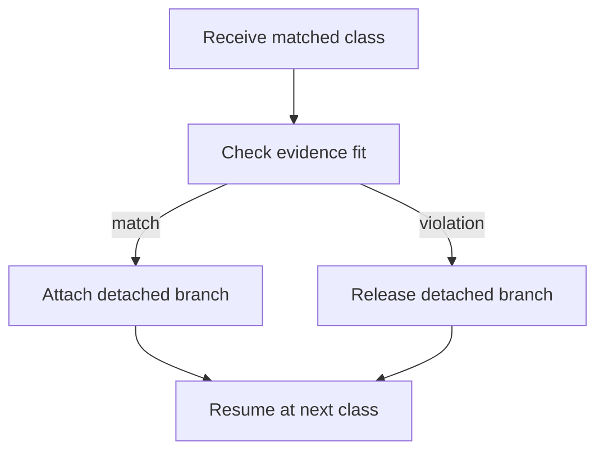

# `core.cpp`

- Folder: `docs/Codebase/Microservice/Modules/Source/Trees/ClassGeneration/Attachment`
- Role: final decision point for attaching or releasing the detached virtual-broken branch

## Start Here
- Read this file first if you want the last decision after actual class-subtree generation and virtual-broken evidence assembly finish for a class.

## Quick Summary
- This folder does not build either branch.
- It decides whether matched detached virtual-broken evidence becomes part of the main tree or gets released.

## Why This Folder Is Separate
- Attachment is not the same as generation.
- The actual class-declaration subtree already exists in the main tree before this folder runs.
- The detached virtual-broken branch still needs a final pass/fail decision.

## Major Workflow

## Decision Rules
- Attach only if the completed class-declaration subtree still fits the expected strict structure after evidence assembly.
- Release immediately on evidence divergence.
- Never remove or rewrite the already-rooted actual subtree because the actual branch records source truth.
- When attach succeeds, the class registry record should pair the `std::hash`-derived class key with both subtree head pointers: actual code and virtual copy.
- When attach fails, do not leave a registry record that points to the released virtual branch.
- If registry update sees an existing hash bucket for another identity, treat it as a collision and report it through the symbol-table diagnostic path.

## Acceptance Checks
- Attach-on-success is described separately from generation.
- Discard-on-failure is explicit.
- The next class restart is part of the documented lifecycle.
- Successful attach finalizes the class registry pointers for actual and virtual subtree heads.
