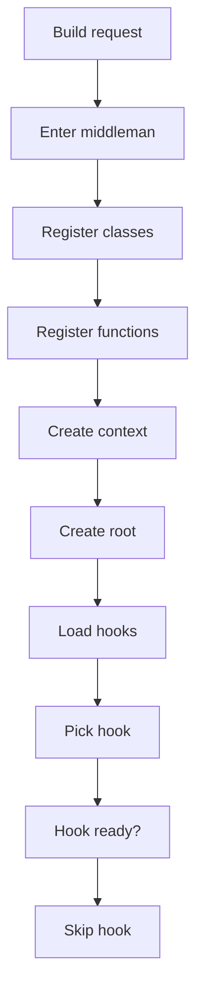
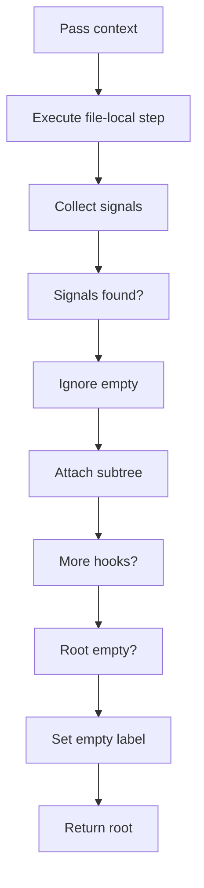
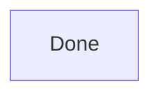
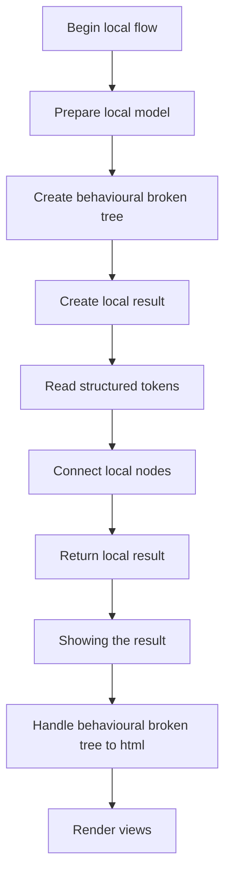
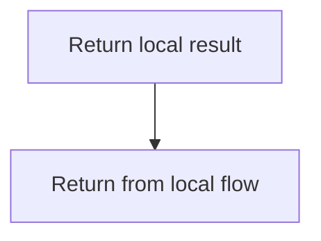
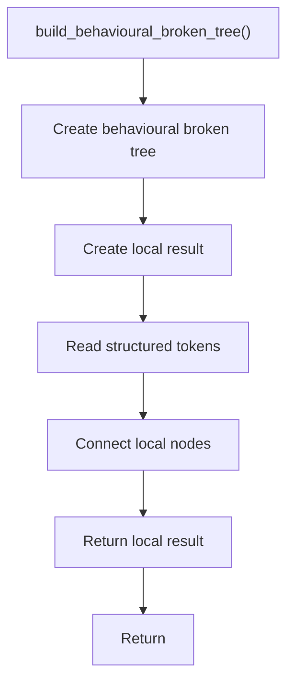
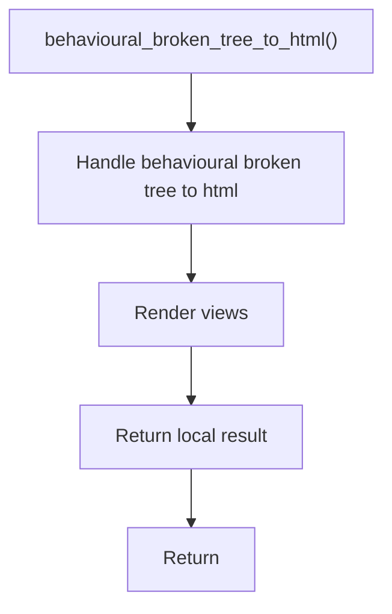

# behavioural_broken_tree.cpp

- Source: Microservice/Modules/Source/Behavioural/behavioural_broken_tree.cpp
- Kind: C++ implementation

## Story
### What Happens Here

This source file implements behavioural-pattern scaffolding or checks against completed class-declaration subtrees. It contributes virtual-broken evidence only after a specific actual class subtree exists.

### Why It Matters In The Flow

Runs after a specific class-declaration subtree exists so behavioural scaffolds can evaluate that completed class.

### What To Watch While Reading

Implements behavioural detection and structural verification scaffolds. The main surface area is easiest to track through symbols such as BehaviouralFunctionScaffoldDetector, BehaviouralStructureCheckerDetector, DefaultBehaviouralTreeCreator, and detect. It collaborates directly with behavioural_broken_tree.hpp, Logic/behavioural_logic_scaffold.hpp, Output-and-Rendering/tree_html_renderer.hpp, and utility.

## Required Middleman Flow
The desired design is that this file behaves as the behavioural middleman for tree assembly. Individual behavioural checks should not own repeated traversal, class registration, function registration, root assembly, or result attachment. They should expose only pattern-specific algorithms through virtual hooks or function-pointer style dispatch.

### Block 1 - Required Middleman Flow Details
#### Slice 1 - Establish Local Entry
Quick summary: This slice shows the first file-local stage for behavioural_broken_tree.cpp and keeps the diagram scoped to this code unit.
Why this is separate: behavioural_broken_tree.cpp has multiple branches, loops, or stage changes, so this section is split out to keep one major intent visible at a time instead of forcing one oversized diagram.

#### Slice 2 - Handle Early Decisions
Quick summary: This slice shows the first local decision path for behavioural_broken_tree.cpp after setup.
Why this is separate: behavioural_broken_tree.cpp has multiple branches, loops, or stage changes, so this section is split out to keep one major intent visible at a time instead of forcing one oversized diagram.

#### Slice 3 - Hand Off Local State
Quick summary: This slice shows how behavioural_broken_tree.cpp passes prepared local state into its next operation.
Why this is separate: behavioural_broken_tree.cpp has multiple branches, loops, or stage changes, so this section is split out to keep one major intent visible at a time instead of forcing one oversized diagram.

## Responsibility Split
- Middleman: class registration, function registration, shared context, traversal order, tree root, child attachment, empty output.
- Pattern hook: Strategy signals, Observer signals, scaffold checks, structure checks.
- Extension point: add a new hook without copying the assembly loop.

## Program Flow
This diagram follows the action path in plain words. Decision diamonds show where the file can stop, branch, or repeat work instead of simply passing through a straight line.

The flow is intentionally split into smaller slices so the major intent of behavioural_broken_tree.cpp stays readable. Each slice names the stage it is covering, gives a quick summary, and explains why that stage is separated from the next one.

### Program Flow Slices
#### Slice 1 - Establish Local Entry
Quick summary: This slice shows the first file-local stage for behavioural_broken_tree.cpp and keeps the diagram scoped to this code unit.
Why this is separate: behavioural_broken_tree.cpp has multiple branches, loops, or stage changes, so this section is split out to keep one major intent visible at a time instead of forcing one oversized diagram.

#### Slice 2 - Handle Early Decisions
Quick summary: This slice shows the first local decision path for behavioural_broken_tree.cpp after setup.
Why this is separate: behavioural_broken_tree.cpp has multiple branches, loops, or stage changes, so this section is split out to keep one major intent visible at a time instead of forcing one oversized diagram.

## Reading Map
Read this file as: Implements behavioural detection and structural verification scaffolds.

Where it sits in the run: Runs after a specific class-declaration subtree exists so behavioural scaffolds can evaluate that completed class.

Names worth recognizing while reading: BehaviouralFunctionScaffoldDetector, BehaviouralStructureCheckerDetector, DefaultBehaviouralTreeCreator, detect, build_behavioural_function_scaffold, and build_behavioural_structure_checker.

It leans on nearby contracts or tools such as behavioural_broken_tree.hpp, Logic/behavioural_logic_scaffold.hpp, Output-and-Rendering/tree_html_renderer.hpp, utility, and vector.

## Story Groups

### Building The Working Picture
These steps assemble the trees, models, or bundles used by the rest of the file.
- build_behavioural_broken_tree(): Create the local output structure, read local tokens, and connect local structures

### Showing The Result
These steps turn internal state into text, HTML, JSON, or another output a reader can inspect.
- behavioural_broken_tree_to_html(): Render text or HTML views

## Function Stories

### build_behavioural_broken_tree()
This routine assembles a larger structure from the inputs it receives.

Inside the body, it mainly handles Create the local output structure, read local tokens, and connect local structures.

The caller receives a computed result or status from this step.

What it does:
- Create the local output structure
- read local tokens
- connect local structures

Flow:

### behavioural_broken_tree_to_html()
This routine owns one focused piece of the file's behavior.

Inside the body, it mainly handles render text or HTML views.

The caller receives a computed result or status from this step.

What it does:
- render text or HTML views

Flow:

## Documentation Note
- This markdown file is part of the generated docs/Codebase mirror.
- It was generated from the repository state on 2026-04-23 after reading the existing docs corpus and the current source tree.

