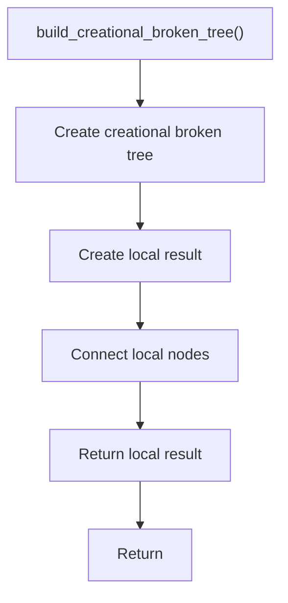

# build_creational_broken_tree.cpp

- Source document: [creational_broken_tree.cpp.md](../../creational_broken_tree.cpp.md)
- Purpose: decoupled implementation logic for a future code unit.

### build_creational_broken_tree()
This routine assembles a larger structure from the inputs it receives.

Inside the body, it mainly handles Create the local output structure and connect local structures.

The caller receives a computed result or status from this step.

What it does:
- Create the local output structure
- connect local structures

Flow:

