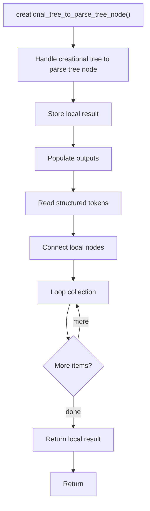

# creational_tree_to_parse_tree_node.cpp

- Source document: [creational_broken_tree.cpp.md](../../creational_broken_tree.cpp.md)
- Purpose: decoupled implementation logic for a future code unit.

### creational_tree_to_parse_tree_node()
This routine owns one focused piece of the file's behavior.

Inside the body, it mainly handles store local findings, fill local output fields, read local tokens, and connect local structures.

The implementation iterates over a collection or repeated workload. The caller receives a computed result or status from this step.

What it does:
- store local findings
- fill local output fields
- read local tokens
- connect local structures
- walk the local collection

Flow:

