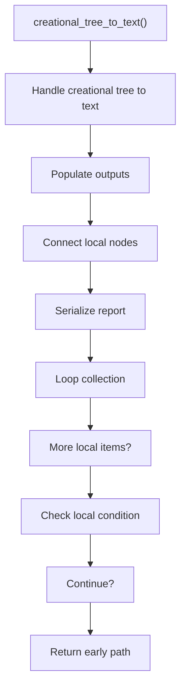
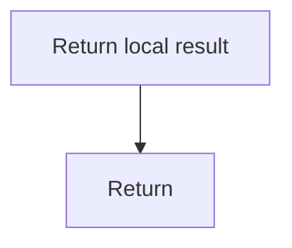

# creational_tree_to_text.cpp

- Source document: [creational_broken_tree.cpp.md](../../creational_broken_tree.cpp.md)
- Purpose: decoupled implementation logic for a future code unit.

### creational_tree_to_text()
This routine owns one focused piece of the file's behavior.

Inside the body, it mainly handles fill local output fields, connect local structures, serialize report content, and walk the local collection.

The implementation iterates over a collection or repeated workload. It branches on runtime conditions instead of following one fixed path. The caller receives a computed result or status from this step.

What it does:
- fill local output fields
- connect local structures
- serialize report content
- walk the local collection
- branch on local conditions

Flow:

### Block 3 - creational_tree_to_text() Details
#### Slice 1 - Establish Local Entry
Quick summary: This slice shows the first file-local stage for creational_tree_to_text.cpp and keeps the diagram scoped to this code unit.
Why this is separate: creational_tree_to_text.cpp has multiple branches, loops, or stage changes, so this section is split out to keep one major intent visible at a time instead of forcing one oversized diagram.

#### Slice 2 - Handle Early Decisions
Quick summary: This slice shows the first local decision path for creational_tree_to_text.cpp after setup.
Why this is separate: creational_tree_to_text.cpp has multiple branches, loops, or stage changes, so this section is split out to keep one major intent visible at a time instead of forcing one oversized diagram.

