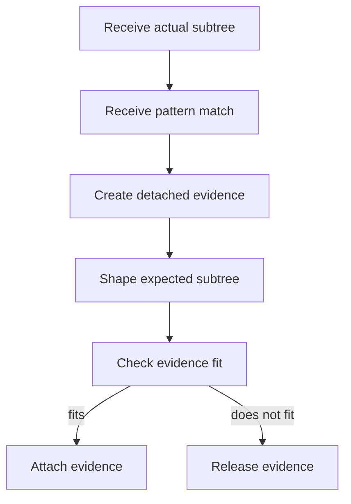

# `core.cpp`

- Folder: `docs/Codebase/Microservice/Modules/Source/Trees/ClassGeneration/VirtualBroken`
- Role: rules for detached virtual evidence built after class-subtree pattern analysis

## Start Here
- Read this file first if you want to understand what the virtual-broken branch is, how it is built, and when it is thrown away.

## Quick Summary
- `VirtualBroken` is one concept, not two separate branches.
- It is a strict, pattern-shaped evidence subtree built from a completed actual class-declaration subtree.
- It is never the input that permits actual class generation; the actual class subtree must already exist first.

## Why This Folder Is Separate
- The actual branch records what is really in the source.
- The virtual-broken branch records the accepted expected structure for a specific pattern shape.
- Because this branch can fail and be discarded, its lifecycle must stay separate from the always-rooted actual branch.

## Major Workflow

## Structure Rules
- This folder covers the same branch that older docs called the broken tree.
- The branch is created per matched class after the actual class-declaration subtree exists.
- It may include both declaration-side and implementation-side expectations for the same class.
- It is not attached to the main tree while pattern evidence is still being assembled.

## Failure Rules
- If the completed class subtree does not fit the expected strict structure, evidence generation stops for this class only.
- The detached branch is released instead of being attached.
- The next detached branch starts only when the actual branch reaches the next class.

## Success Rules
- If the completed class subtree fits the accepted pattern scaffold, the detached branch becomes attachable.
- Attachment itself is handled by `../Attachment/core.cpp.md`.
- The class registry may know the candidate while this branch is detached, but it should not expose the virtual subtree pointer as final until attachment succeeds.

## Acceptance Checks
- The docs explicitly say virtual copy and broken AST are the same branch.
- The docs explicitly say this branch is detached during evidence assembly.
- The docs explicitly say actual class-declaration subtree generation comes first.
- The docs explicitly say failure discards the branch per class.
- The docs keep final registry pointer publication in the attachment stage.
