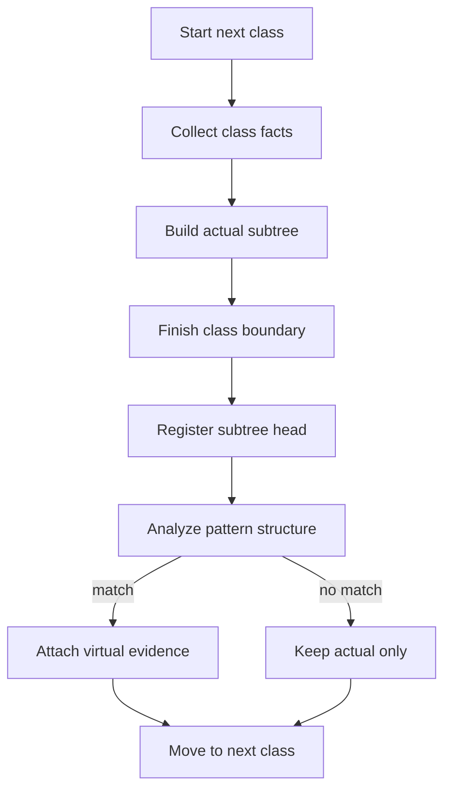

# `core.cpp`

- Folder: `docs/Codebase/Microservice/Modules/Source/Trees/ClassGeneration`
- Role: stage workflow for class-declaration subtree generation before pattern analysis

## Start Here
- Read this file first if you want the per-class lifecycle before dropping into actual, virtual-broken, or attachment details.

## Quick Summary
- Class generation happens one class at a time.
- The parser builds the actual subtree for a specific class declaration before any structural pattern analysis runs.
- The completed subtree head is registered as the candidate that the pattern middleman analyzes.
- A detached virtual-broken subtree is created only as accepted pattern evidence for that completed class.

## Why This Folder Is Separate
- `MainTree/` explains ownership under the root.
- `ClassGeneration/` explains how one class becomes a completed subtree candidate.
- `Attachment/` is separated because attach-or-discard is the final gate for optional virtual-broken evidence.

## Major Workflow

## Lifecycle Rules
- The generation unit is one class, not one whole file-sized temporary branch.
- Actual class-declaration subtree generation completes before structural pattern analysis starts.
- Lexical events can validate class boundaries and feed class facts, but they do not decide final design-pattern acceptance.
- Pattern checks consume the registered actual subtree head and usage context.
- If no pattern matches, the actual subtree remains the source-truth branch and no virtual-broken evidence attaches.
- After each class decision, the system waits for the actual branch to progress to the next class before starting another candidate.

## Local Ownership
- `Actual/` owns the literal class declaration and implementation structure.
- `VirtualBroken/` owns strict expected-pattern evidence generated from a matched completed class.
- `Attachment/` owns the last decision to attach or release the detached branch.

## Acceptance Checks
- The docs say actual class-declaration subtree generation happens before pattern analysis.
- The docs say the virtual-broken lifecycle is per class.
- The docs show the actual subtree as the input into structural pattern analysis.
- The docs say pattern failure leaves the actual subtree intact and attaches no virtual evidence.
