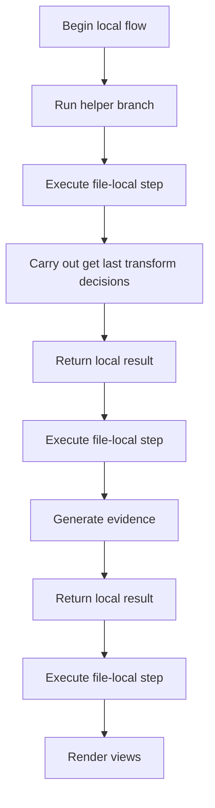
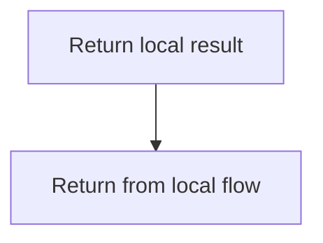
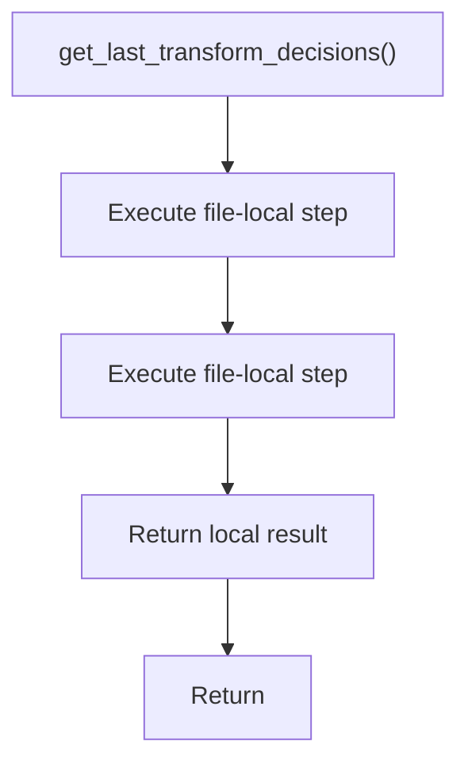
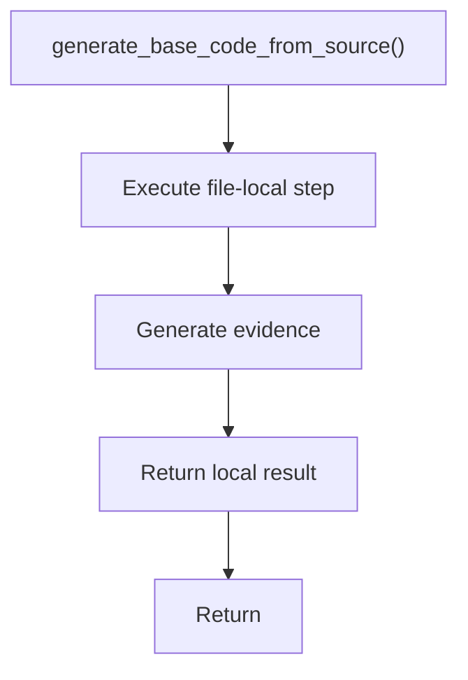
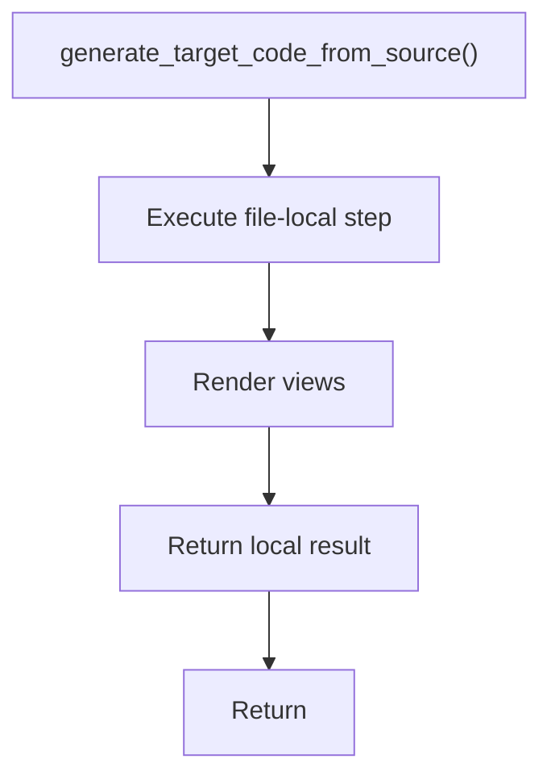

# code_generator.cpp

- Source: Microservice/Modules/Source/ParseTree/code_generator.cpp
- Kind: C++ implementation

## Story
### What Happens Here

This source file implements one internal part of the generic parse-tree engine. It contributes specialized behavior such as dependency handling, symbolization, hash-link construction, rendering, or older generation helpers after the raw tree exists. This source file implements one of the generic middle-stage services in the C++ pipeline. It is executed after sources are loaded and before the final report and rendered outputs are written.

### Why It Matters In The Flow

Runs across the middle of the microservice flow to build parse trees, hash links, symbol tables, documentation tags, reports, and rendered outputs.

### What To Watch While Reading

Implements parsing, shadow-tree building, symbolization, hash linking, rendering, and reporting. The main surface area is easiest to track through symbols such as get_last_transform_decisions, generate_base_code_from_source, render_creational_evidence_view, and generate_target_code_from_source. It collaborates directly with parse_tree_code_generator.hpp and Transform/creational_transform_pipeline.hpp.

## Program Flow
This diagram follows the action path in plain words. Decision diamonds show where the file can stop, branch, or repeat work instead of simply passing through a straight line.

The flow is intentionally split into smaller slices so the major intent of code_generator.cpp stays readable. Each slice names the stage it is covering, gives a quick summary, and explains why that stage is separated from the next one.

### Program Flow Slices
#### Slice 1 - Establish Local Entry
Quick summary: This slice shows the first file-local stage for code_generator.cpp and keeps the diagram scoped to this code unit.
Why this is separate: code_generator.cpp has multiple branches, loops, or stage changes, so this section is split out to keep one major intent visible at a time instead of forcing one oversized diagram.

#### Slice 2 - Handle Early Decisions
Quick summary: This slice shows the first local decision path for code_generator.cpp after setup.
Why this is separate: code_generator.cpp has multiple branches, loops, or stage changes, so this section is split out to keep one major intent visible at a time instead of forcing one oversized diagram.

## Reading Map
Read this file as: Implements parsing, shadow-tree building, symbolization, hash linking, rendering, and reporting.

Where it sits in the run: Runs across the middle of the microservice flow to build parse trees, hash links, symbol tables, documentation tags, reports, and rendered outputs.

Names worth recognizing while reading: get_last_transform_decisions, generate_base_code_from_source, render_creational_evidence_view, and generate_target_code_from_source.

It leans on nearby contracts or tools such as parse_tree_code_generator.hpp and Transform/creational_transform_pipeline.hpp.

## Story Groups

### Supporting Steps
These steps support the local behavior of the file.
- get_last_transform_decisions(): Owns a focused local responsibility.
- generate_base_code_from_source(): Generate code or evidence output
- generate_target_code_from_source(): Render text or HTML views

## Function Stories

### get_last_transform_decisions()
This routine owns one focused piece of the file's behavior.

The caller receives a computed result or status from this step.

What it does:
- This routine is primarily structural and does not expose obvious runtime operations from static inspection.

Flow:

### generate_base_code_from_source()
This routine owns one focused piece of the file's behavior.

Inside the body, it mainly handles generate code or evidence output.

The caller receives a computed result or status from this step.

What it does:
- generate code or evidence output

Flow:

### generate_target_code_from_source()
This routine owns one focused piece of the file's behavior.

Inside the body, it mainly handles render text or HTML views.

The caller receives a computed result or status from this step.

What it does:
- render text or HTML views

Flow:

## Documentation Note
- This markdown file is part of the generated docs/Codebase mirror.
- It was generated from the repository state on 2026-04-23 after reading the existing docs corpus and the current source tree.

