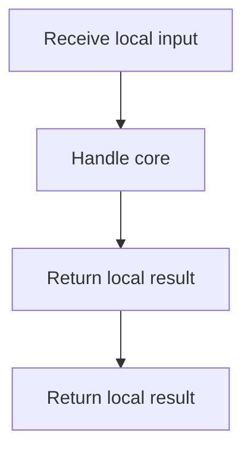

# `core.cpp`

- Folder: `docs/Codebase/Microservice/Modules/Source/Trees/Shared`
- Role: shared tree utilities that support more than one tree-side branch without owning the main generation lifecycle

## Start Here
- Read this file first if you want to know why a helper belongs in `Shared/` instead of `MainTree/` or `ClassGeneration/`.

## Quick Summary
- `Shared/` holds reusable tree-side support logic.
- These files support more than one branch or stage and do not own the main attachment lifecycle.

## Why This Folder Is Separate
- `MainTree/` owns root and file-node attachment rules.
- `ClassGeneration/` owns actual and virtual-broken construction.
- `Shared/` owns only cross-branch helpers.

## Local Ownership
- `dependency_utils.cpp.md` supports tree-side dependency context.
- `code_generator.cpp.md` supports reusable tree-side generation output.

## Acceptance Checks
- Shared helpers are not presented as their own branch lifecycle.
- Ownership stays with helpers that are genuinely cross-branch.

## Program Flow
Quick summary: this diagram shows the file-local activity path for this implementation unit. It stays inside this code file and uses only entry and return boundaries as external references.

Why this slice is separate: deeper helper docs can explain individual functions, while this file still needs to show the main activity path in place.

