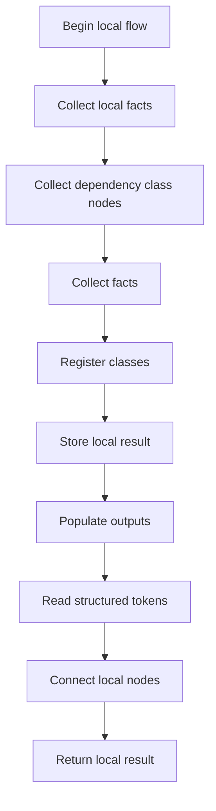
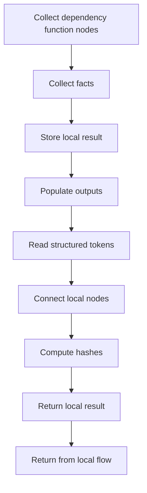
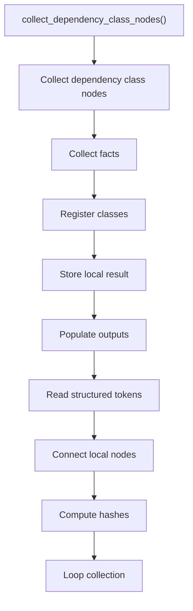
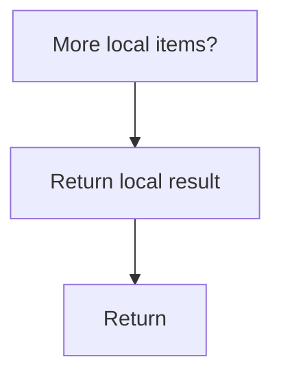
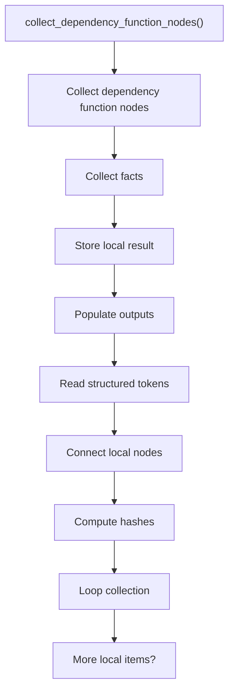
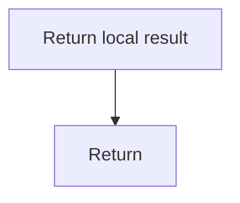

# dependency_utils.cpp

- Source: Microservice/Modules/Source/ParseTree/dependency_utils.cpp
- Kind: C++ implementation

## Story
### What Happens Here

This source file implements one internal part of the generic parse-tree engine. It contributes specialized behavior such as dependency handling, symbolization, hash-link construction, rendering, or older generation helpers after the raw tree exists. This source file implements one of the generic middle-stage services in the C++ pipeline. It is executed after sources are loaded and before the final report and rendered outputs are written.

### Why It Matters In The Flow

Runs across the middle of the microservice flow to build parse trees, hash links, symbol tables, documentation tags, reports, and rendered outputs.

### What To Watch While Reading

Implements parsing, shadow-tree building, symbolization, hash linking, rendering, and reporting. The main surface area is easiest to track through symbols such as collect_dependency_class_nodes and collect_dependency_function_nodes. It collaborates directly with parse_tree_dependency_utils.hpp, parse_tree_symbols.hpp, and utility.

## Program Flow
This diagram follows the action path in plain words. Decision diamonds show where the file can stop, branch, or repeat work instead of simply passing through a straight line.

The flow is intentionally split into smaller slices so the major intent of dependency_utils.cpp stays readable. Each slice names the stage it is covering, gives a quick summary, and explains why that stage is separated from the next one.

### Program Flow Slices
#### Slice 1 - Establish Local Entry
Quick summary: This slice shows the first file-local stage for dependency_utils.cpp and keeps the diagram scoped to this code unit.
Why this is separate: dependency_utils.cpp has multiple branches, loops, or stage changes, so this section is split out to keep one major intent visible at a time instead of forcing one oversized diagram.

#### Slice 2 - Handle Early Decisions
Quick summary: This slice shows the first local decision path for dependency_utils.cpp after setup.
Why this is separate: dependency_utils.cpp has multiple branches, loops, or stage changes, so this section is split out to keep one major intent visible at a time instead of forcing one oversized diagram.

## Reading Map
Read this file as: Implements parsing, shadow-tree building, symbolization, hash linking, rendering, and reporting.

Where it sits in the run: Runs across the middle of the microservice flow to build parse trees, hash links, symbol tables, documentation tags, reports, and rendered outputs.

Names worth recognizing while reading: collect_dependency_class_nodes and collect_dependency_function_nodes.

It leans on nearby contracts or tools such as parse_tree_dependency_utils.hpp, parse_tree_symbols.hpp, and utility.

## Story Groups

### Finding What Matters
These steps pick out the facts, traces, and relationships that later stages need.
- collect_dependency_class_nodes(): Collect derived facts for later stages, inspect or register class-level information, and store local findings
- collect_dependency_function_nodes(): Collect derived facts for later stages, store local findings, and fill local output fields

## Function Stories

### collect_dependency_class_nodes()
This routine connects discovered items back into the broader model owned by the file.

Inside the body, it mainly handles collect derived facts for later stages, inspect or register class-level information, store local findings, and fill local output fields.

The implementation iterates over a collection or repeated workload. The caller receives a computed result or status from this step.

What it does:
- collect derived facts for later stages
- inspect or register class-level information
- store local findings
- fill local output fields
- read local tokens
- connect local structures
- compute hash metadata
- walk the local collection

Flow:

### Block 2 - collect_dependency_class_nodes() Details
#### Slice 1 - Establish Local Entry
Quick summary: This slice shows the first file-local stage for dependency_utils.cpp and keeps the diagram scoped to this code unit.
Why this is separate: dependency_utils.cpp has multiple branches, loops, or stage changes, so this section is split out to keep one major intent visible at a time instead of forcing one oversized diagram.

#### Slice 2 - Handle Early Decisions
Quick summary: This slice shows the first local decision path for dependency_utils.cpp after setup.
Why this is separate: dependency_utils.cpp has multiple branches, loops, or stage changes, so this section is split out to keep one major intent visible at a time instead of forcing one oversized diagram.

### collect_dependency_function_nodes()
This routine connects discovered items back into the broader model owned by the file.

Inside the body, it mainly handles collect derived facts for later stages, store local findings, fill local output fields, and read local tokens.

The implementation iterates over a collection or repeated workload. The caller receives a computed result or status from this step.

What it does:
- collect derived facts for later stages
- store local findings
- fill local output fields
- read local tokens
- connect local structures
- compute hash metadata
- walk the local collection

Flow:

### Block 3 - collect_dependency_function_nodes() Details
#### Slice 1 - Establish Local Entry
Quick summary: This slice shows the first file-local stage for dependency_utils.cpp and keeps the diagram scoped to this code unit.
Why this is separate: dependency_utils.cpp has multiple branches, loops, or stage changes, so this section is split out to keep one major intent visible at a time instead of forcing one oversized diagram.

#### Slice 2 - Handle Early Decisions
Quick summary: This slice shows the first local decision path for dependency_utils.cpp after setup.
Why this is separate: dependency_utils.cpp has multiple branches, loops, or stage changes, so this section is split out to keep one major intent visible at a time instead of forcing one oversized diagram.

## Documentation Note
- This markdown file is part of the generated docs/Codebase mirror.
- It was generated from the repository state on 2026-04-23 after reading the existing docs corpus and the current source tree.

