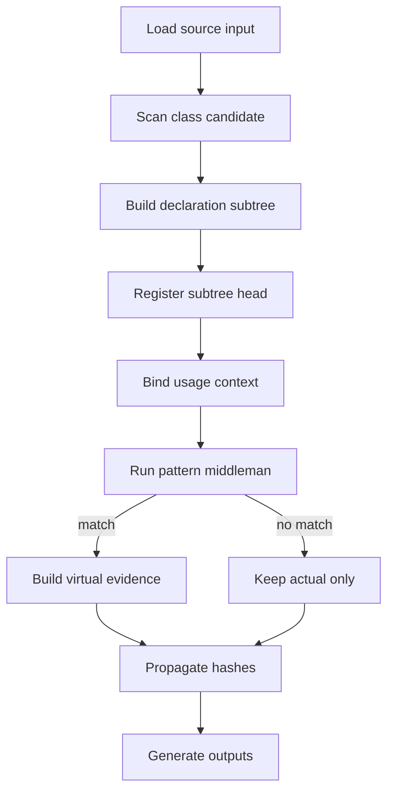
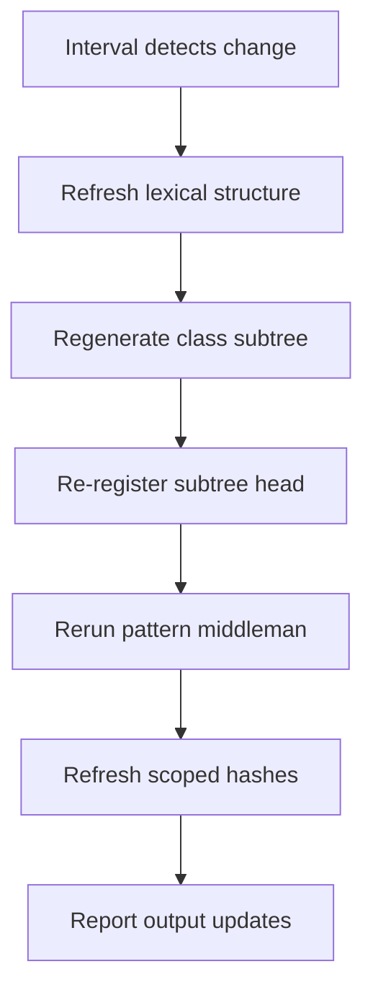

# `core.cpp`

- Folder: `docs/Codebase/Microservice/Modules/Source`
- Role: source-side orchestration entrypoint for class-subtree-first analysis

## Start Here
This is the first file to read when you want the whole source-side flow before diving into any local folder.

## Name Boundary
The executable `main.cpp` is documented at `docs/Codebase/Microservice/main.cpp.md`. This file is the source-module orchestration blueprint, so it uses `core.cpp.md` instead of creating a second conceptual `main.cpp.md`.

## Main Intent
This subsystem reads source input, finds class candidates, generates the actual subtree for each specific class declaration, registers that subtree as the analysis target, and only then runs structural pattern analysis through the catalog and middleman layers.

The actual class-declaration subtree is the required artifact. Structural pattern analysis must not run from raw lexical events, a user-selected pattern, or a detached virtual-broken guess before that class subtree exists.

## Reading Order
1. `Analysis/core.cpp.md`
2. `Trees/core.cpp.md`
3. `HashingMechanism/core.cpp.md`
4. `Diffing/core.cpp.md`
5. `OutputGeneration/core.cpp.md`

## Runtime Shape
`Analysis/` extracts lexical and usage facts. `Trees/` materializes those facts into actual class-declaration subtrees. `Analysis/Patterns/` consumes completed class subtrees and usage context to decide which structural patterns match. `HashingMechanism/` gives the accepted structures stable identity. `Diffing/` reuses the same order when it regenerates affected regions.

## Major Handoffs
- `Analysis/` identifies class candidates, lexical structure, usage context, and pattern-relevant token streams without final pattern acceptance.
- `Trees/` roots the actual branch under file nodes and generates each specific class-declaration subtree.
- `Analysis/Patterns/` receives completed class subtrees, loads the catalog, and runs the structural pattern middleman.
- `HashingMechanism/` gives those structures stable cascading identities and lookup paths.
- `Diffing/` re-runs lexical structural analysis on changed regions, locates affected actual subtrees, compares virtual and actual equivalents, and returns partial regeneration plans.
- `OutputGeneration/` converts the analyzed bundle into tests, tags, reports, and rendered outputs.

## Flow

## Interval Diffing Flow
This flow runs after the initial tree state exists. It keeps regeneration scoped to affected subtrees.

## Jump Directly To
- `Analysis/core.cpp.md` if you only want lexical, binding, or pattern logic
- `Trees/core.cpp.md` if you only want rooted tree ownership and actual class-subtree generation
- `HashingMechanism/core.cpp.md` if you only want reverse-Merkle and hash-link lookup
- `Diffing/core.cpp.md` if you only want interval checking and partial regeneration planning
- `OutputGeneration/core.cpp.md` if you only want tests, tags, reports, or render outputs

## Acceptance Checks
- the whole source subsystem can be understood from this file before entering subfolders
- each later folder is a handoff stage, not a hidden top-level entrypoint
- structural pattern analysis starts only after a specific class-declaration subtree has been generated and registered
- the root executable entrypoint remains documented only at `docs/Codebase/Microservice/main.cpp.md`
