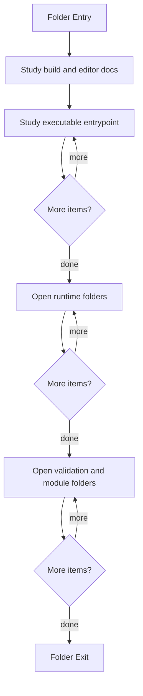

# Microservice

- Folder: docs/Codebase/Microservice
- Descendant source docs: 99
- Generated on: 2026-04-23

## Logic Summary
C++ executable, build configuration, editor configuration, and module tree that implement the parser, detector, documentation tagging, rendering, and report pipeline.

## Subsystem Story
This folder is the owner of C++ microservice concerns. Build files, IDE configuration, executable entrypoints, runtime orchestration, validation assets, and module implementation docs should live here instead of at the `docs/Codebase` root.

## Folder Flow

## Child Folders By Logic
### Runtime
These child folders continue the subsystem by covering application runtime orchestration around the deeper module code.
- Runtime/ : CLI validation, file discovery, pipeline execution, diagnostics, and output writing.

### Validation Assets
These child folders continue the subsystem by covering Validation-oriented source corpus and test support assets.
- Test/ : Validation-oriented source corpus and test support assets.

### Module Tree
These child folders continue the subsystem by covering Modularized C++ implementation divided into compile-time headers and source implementations.
- Modules/ : Modularized C++ implementation divided into compile-time headers and source implementations.

## Documents By Logic
### Build And Editor Setup
These documents explain the local C++ build and editor surface for the microservice.
- CMakeLists.txt.md : Builds the NeoTerritory executable from the microservice layer and module sources.
- CMakeSettings.json.md : Stores IDE-oriented CMake configuration defaults.
- CppProperties.json.md : Provides editor include-path and IntelliSense settings.

### Executable Entrypoints
These documents explain the local implementation by covering Thin executable entrypoint that delegates to the syntactic broken AST runner.
- main.cpp.md : Thin executable entrypoint that delegates to the syntactic broken AST runner.

## Entrypoint Boundary
- `main.cpp.md` is the only executable entrypoint document for the microservice root.
- The source-module algorithm entrypoint lives at `Modules/Source/core.cpp.md` so readers do not confuse it with another runtime `main.cpp`.

## Reading Hint
- Read the local file docs first for concrete behavior, then descend into the child folders for narrower subsystem details.
