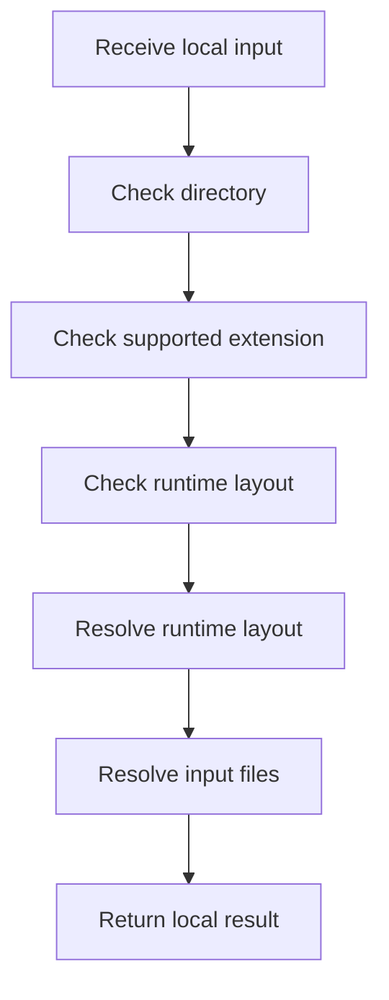

# syntacticBrokenAST.cpp

- Source: Microservice/Runtime/Back system/syntacticBrokenAST.cpp
- Kind: C++ implementation

## Story
### What Happens Here

This application-layer source file implements the runtime story that wraps the core parser modules. It is responsible for validating arguments, discovering files, invoking the analysis pipeline, and materializing all of the generated outputs.

### Why It Matters In The Flow

Runs after process startup to validate CLI args, discover input files, execute the pipeline, and write documentation-oriented outputs.

### What To Watch While Reading

Owns application-layer orchestration around parsing, documentation tagging, and report emission. The main surface area is easiest to track through symbols such as RuntimeLayout, supported_extensions_text, print_error_diagnostics, and get_executable_dir. It collaborates directly with Input-and-CLI/source_reader.hpp, Pipeline-Contracts/algorithm_pipeline.hpp, Input-and-CLI/cli_arguments.hpp, and Language-and-Structure/lexical_structure_hooks.hpp.

## Program Flow
Quick summary: this diagram shows the file-local activity path for this implementation unit. It stays inside this code file and uses only entry and return boundaries as external references.

Why this slice is separate: deeper helper docs can explain individual functions, while this file still needs to show the main activity path in place.

Detailed program flow is decoupled into future implementation units:

- [program_flow_01](./syntacticBrokenAST/syntacticBrokenAST_program_flow_01.cpp.md)
- [program_flow_02](./syntacticBrokenAST/syntacticBrokenAST_program_flow_02.cpp.md)
## Reading Map
Read this file as: Owns application-layer orchestration around parsing, documentation tagging, and report emission.

Where it sits in the run: Runs after process startup to validate CLI args, discover input files, execute the pipeline, and write documentation-oriented outputs.

Names worth recognizing while reading: RuntimeLayout, supported_extensions_text, print_error_diagnostics, get_executable_dir, std::filesystem::current_path, and ensure_directory.

It leans on nearby contracts or tools such as Input-and-CLI/source_reader.hpp, Pipeline-Contracts/algorithm_pipeline.hpp, Input-and-CLI/cli_arguments.hpp, Language-and-Structure/lexical_structure_hooks.hpp, parse_tree.hpp, and parse_tree_symbols.hpp.

## Story Groups

### Checks Before Moving On
These steps stop bad input or unsupported state before it can confuse the next part of the run.
- ensure_directory(): Validate assumptions before continuing and inspect or prepare filesystem paths
- has_supported_extension(): Owns a focused local responsibility.
- ensure_runtime_layout(): Validate assumptions before continuing, fill local output fields, and walk the local collection

### Finding What Matters
These steps pick out the facts, traces, and relationships that later stages need.
- resolve_runtime_layout(): Connect discovered data back into the shared model and fill local output fields

### Building The Working Picture
These steps assemble the trees, models, or bundles used by the rest of the file.
- discover_input_files(): store local findings, inspect or prepare filesystem paths, and connect local structures

### Showing The Result
These steps turn internal state into text, HTML, JSON, or another output a reader can inspect.
- print_error_diagnostics(): Render or serialize the result, walk the local collection, and branch on local conditions
- write_text_file(): Render or serialize the result, fill local output fields, and write generated artifacts
- write_tree_outputs(): Render or serialize the result, write generated artifacts, and read local tokens
- print_performance_report(): Render or serialize the result, validate pipeline invariants, and walk the local collection
- print_symbol_diagnostics(): Render or serialize the result, work with symbol-oriented state, and compute hash metadata
- print_design_pattern_tags(): Render or serialize the result and walk the local collection

### Main Path
These steps drive the main execution path by calling the supporting work in order.
- run_syntactic_broken_ast(): Drive the main execution path, fill local output fields, and write generated artifacts

### Supporting Steps
These steps support the local behavior of the file.
- supported_extensions_text(): Owns a focused local responsibility.
- get_executable_dir(): Inspect or prepare filesystem paths and branch on local conditions

## Function Stories
Function-level logic is decoupled into future implementation units:

- [supported_extensions_text](./syntacticBrokenAST/functions/supported_extensions_text.cpp.md)
- [print_error_diagnostics](./syntacticBrokenAST/functions/print_error_diagnostics.cpp.md)
- [get_executable_dir](./syntacticBrokenAST/functions/get_executable_dir.cpp.md)
- [ensure_directory](./syntacticBrokenAST/functions/ensure_directory.cpp.md)
- [has_supported_extension](./syntacticBrokenAST/functions/has_supported_extension.cpp.md)
- [discover_input_files](./syntacticBrokenAST/functions/discover_input_files.cpp.md)
- [resolve_runtime_layout](./syntacticBrokenAST/functions/resolve_runtime_layout.cpp.md)
- [ensure_runtime_layout](./syntacticBrokenAST/functions/ensure_runtime_layout.cpp.md)
- [write_text_file](./syntacticBrokenAST/functions/write_text_file.cpp.md)
- [write_tree_outputs](./syntacticBrokenAST/functions/write_tree_outputs.cpp.md)
- [print_performance_report](./syntacticBrokenAST/functions/print_performance_report.cpp.md)
- [print_symbol_diagnostics](./syntacticBrokenAST/functions/print_symbol_diagnostics.cpp.md)
- [print_design_pattern_tags](./syntacticBrokenAST/functions/print_design_pattern_tags.cpp.md)
- [run_syntactic_broken_ast](./syntacticBrokenAST/functions/run_syntactic_broken_ast.cpp.md)
## Documentation Note
- This markdown file is part of the generated docs/Codebase mirror.
- It was generated from the repository state on 2026-04-23 after reading the existing docs corpus and the current source tree.
