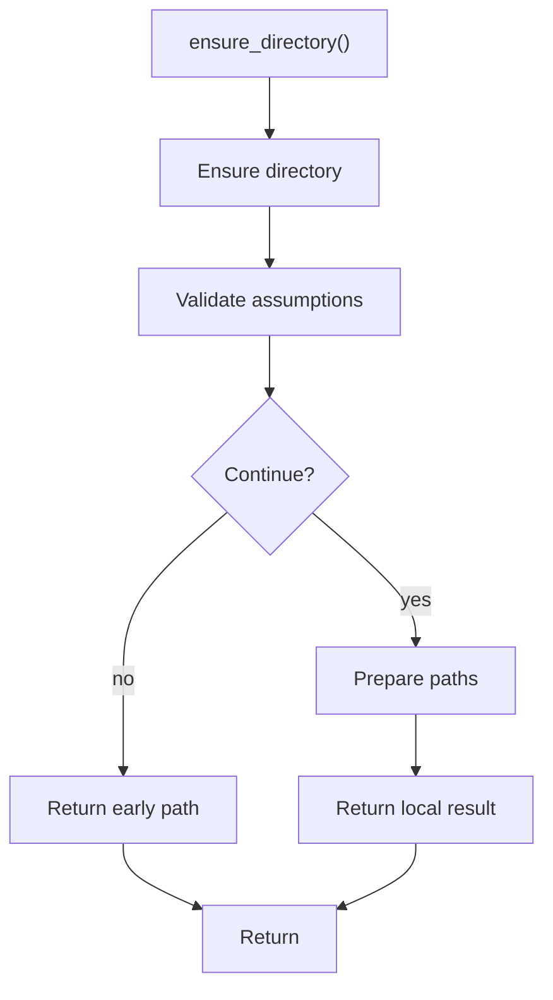

# ensure_directory.cpp

- Source document: [syntacticBrokenAST.cpp.md](../../syntacticBrokenAST.cpp.md)
- Purpose: decoupled implementation logic for a future code unit.

### ensure_directory()
This routine owns one focused piece of the file's behavior.

Inside the body, it mainly handles validate assumptions before continuing and inspect or prepare filesystem paths.

The caller receives a computed result or status from this step.

What it does:
- validate assumptions before continuing
- inspect or prepare filesystem paths

Flow:

