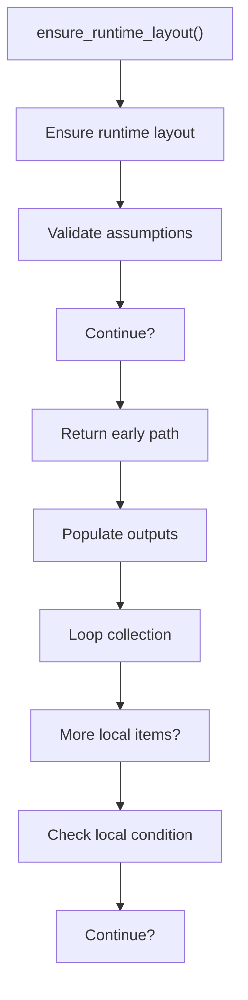
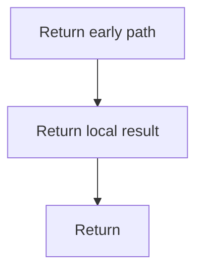

# ensure_runtime_layout.cpp

- Source document: [syntacticBrokenAST.cpp.md](../../syntacticBrokenAST.cpp.md)
- Purpose: decoupled implementation logic for a future code unit.

### ensure_runtime_layout()
This routine owns one focused piece of the file's behavior.

Inside the body, it mainly handles validate assumptions before continuing, fill local output fields, walk the local collection, and branch on local conditions.

The implementation iterates over a collection or repeated workload. It branches on runtime conditions instead of following one fixed path. The caller receives a computed result or status from this step.

What it does:
- validate assumptions before continuing
- fill local output fields
- walk the local collection
- branch on local conditions

Flow:

### Block 3 - ensure_runtime_layout() Details
#### Slice 1 - Continue Local Flow

#### Slice 2 - Continue Local Flow

